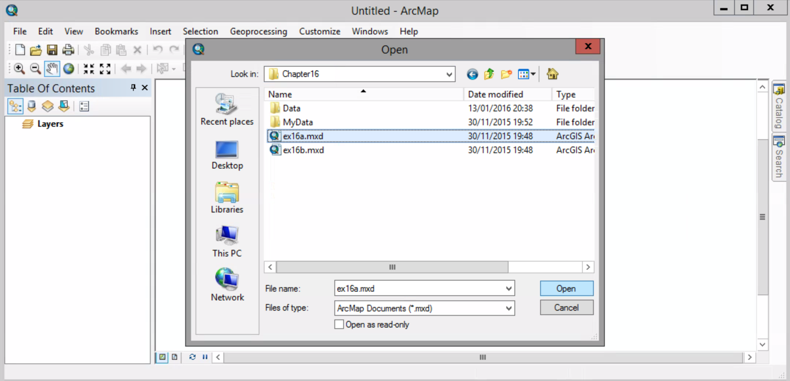
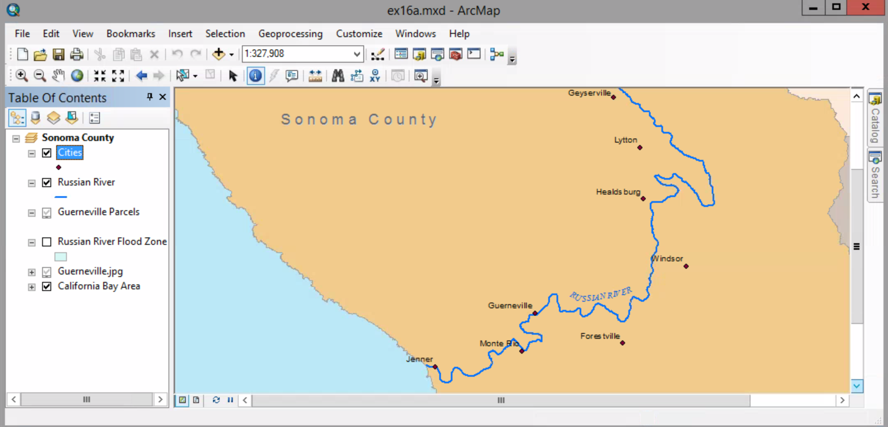
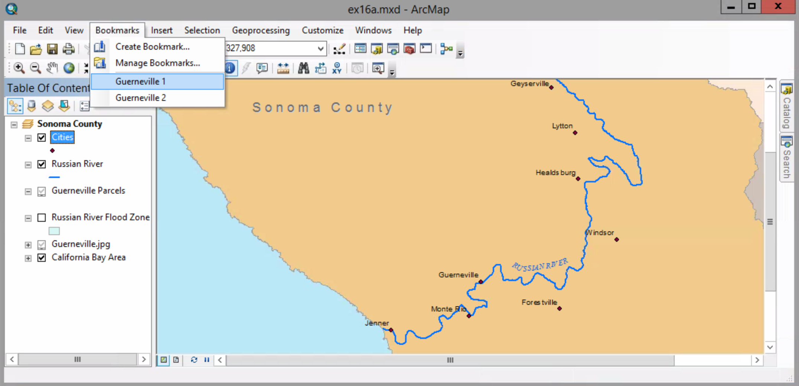
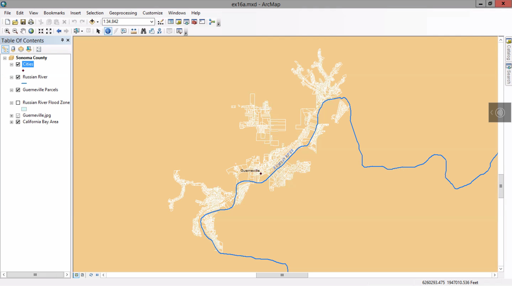
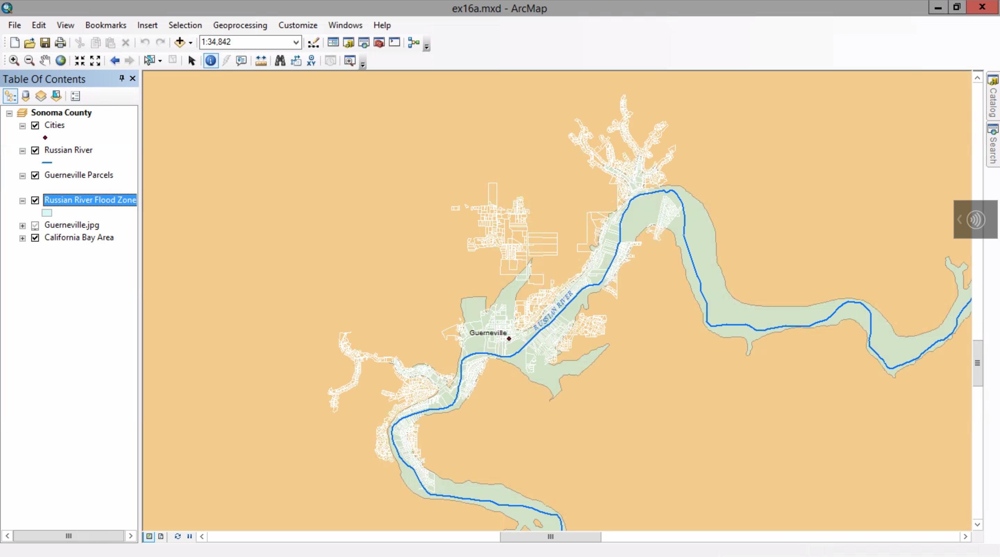
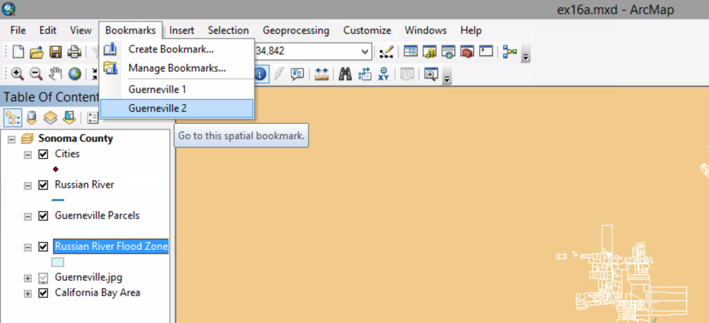

# Using location queries

##### 1. Open the map document

##### 2. Go to the Guernevile1 bookmark.

##### 3. Turn on the Russian River Flood Zone layer.

##### 4. Zoom to the Guernevile2 bookmark. Turn off the Cities and Russian River Flood Zone layer.

##### 5. Selection menu > Select by Location

##### 6. On the dialog box, do these settings:
##### Selection method --> select feature from
##### Target Layer(s) --> Guernevile Parcels
##### Source layer --> Russian River Flood Zone
##### Spatial selection method for target...  --> intersect the source layer feature
##### Click OK

