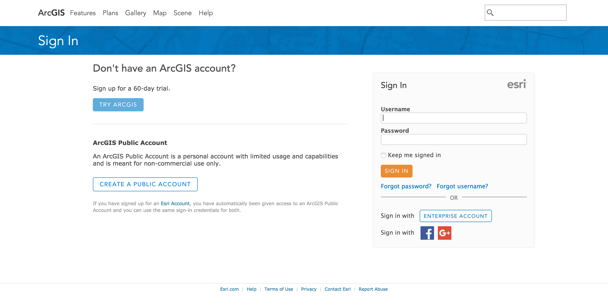
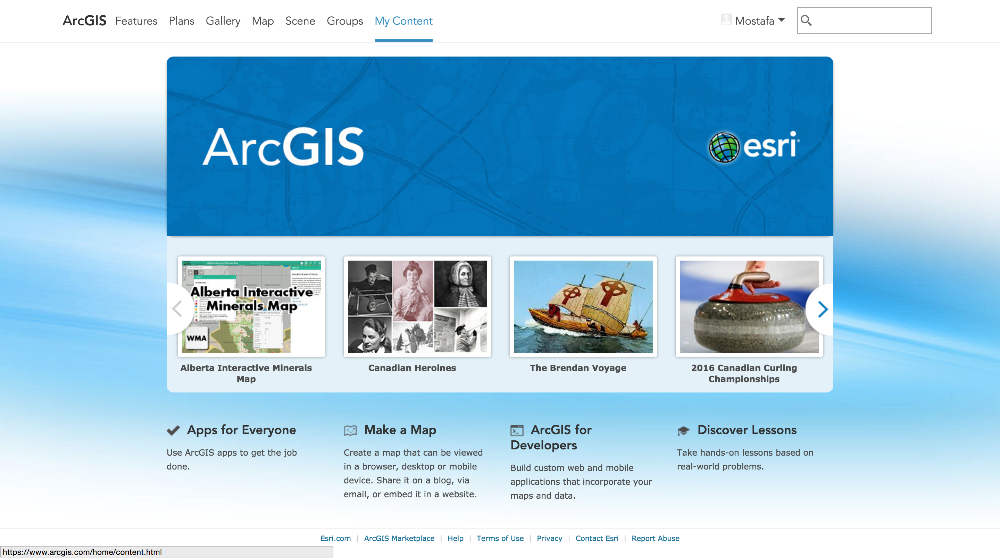
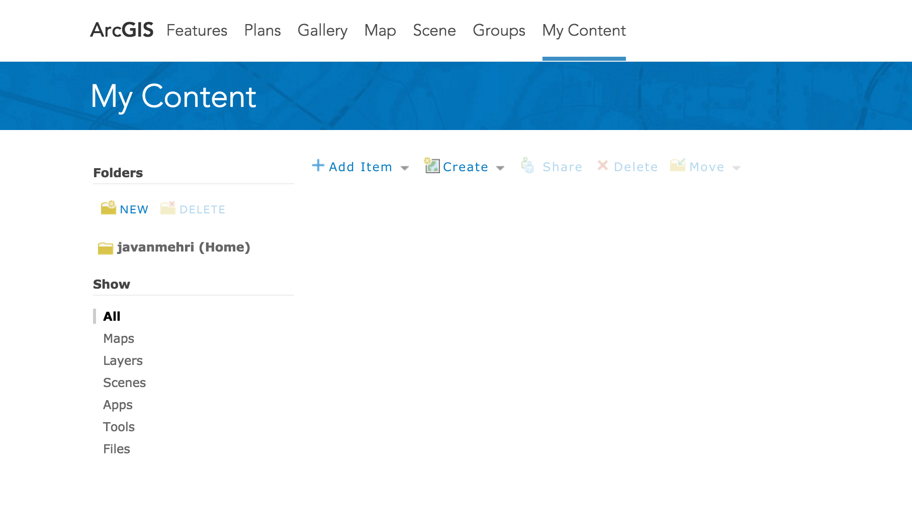

# Creating a web map

##### 1. In a web browser, go to: http://www.arcgis.com. 

In the upper-right corner, click Sign In.

If you already have an Esri account, sign in and skip to step 3.

##### 2. If you don't have an Esri account, create one.

##### 3. On the main navigation bar at the top, click My Content.

