# Creating a geodatabase

##### 1. Open the Blank Map template. Open the Catalog window. Add Chapter11 Folder to the Folder Connection. 

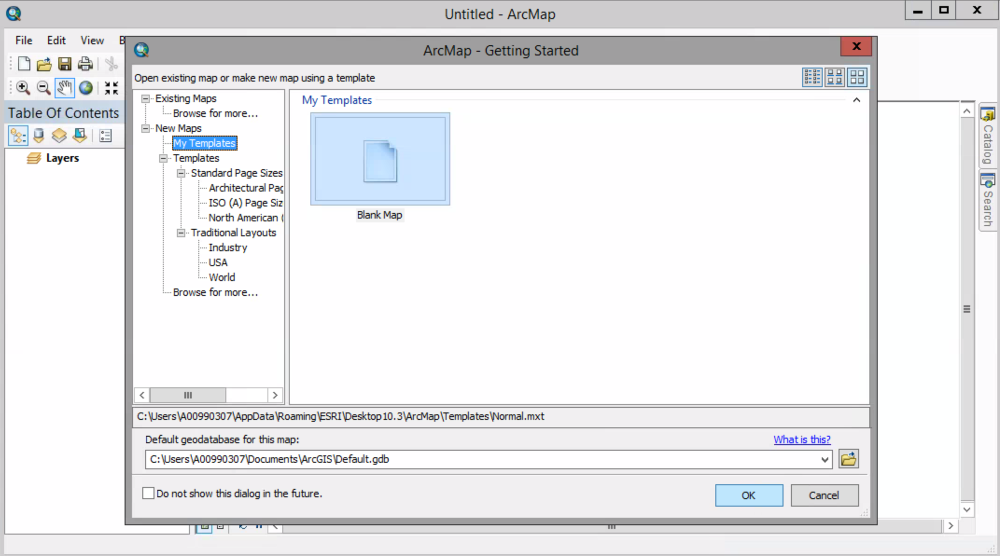

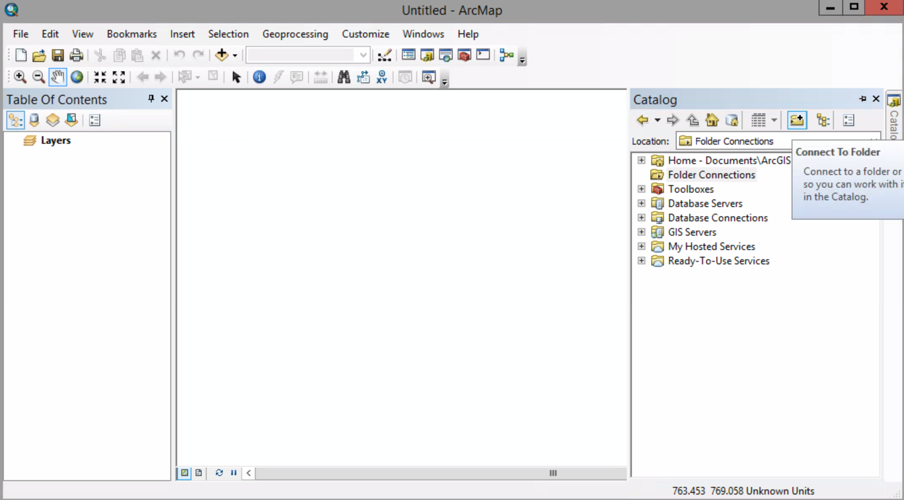

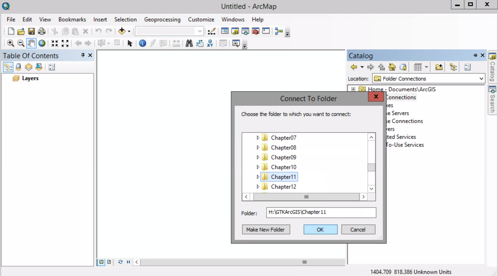

##### 2. Right-click MyData > New > File Geodatabase

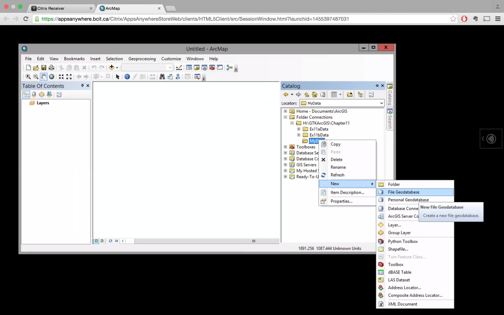

##### 3. Rename the geodatabase

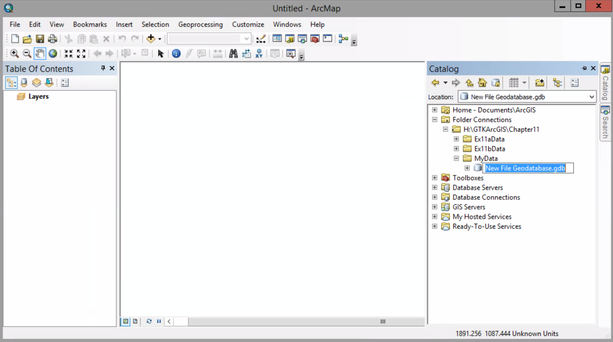

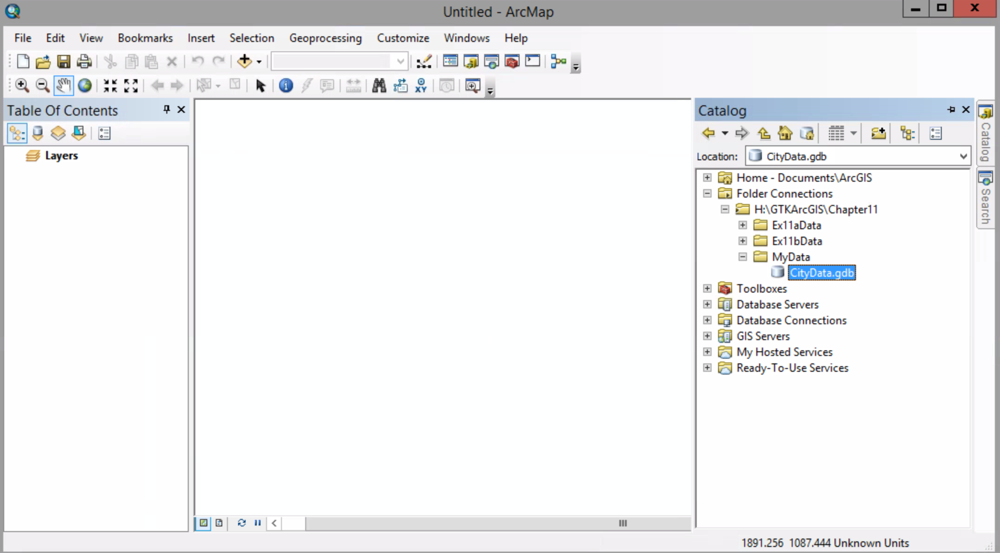

##### 4. Right-click > Import > Feature Class (multiple)

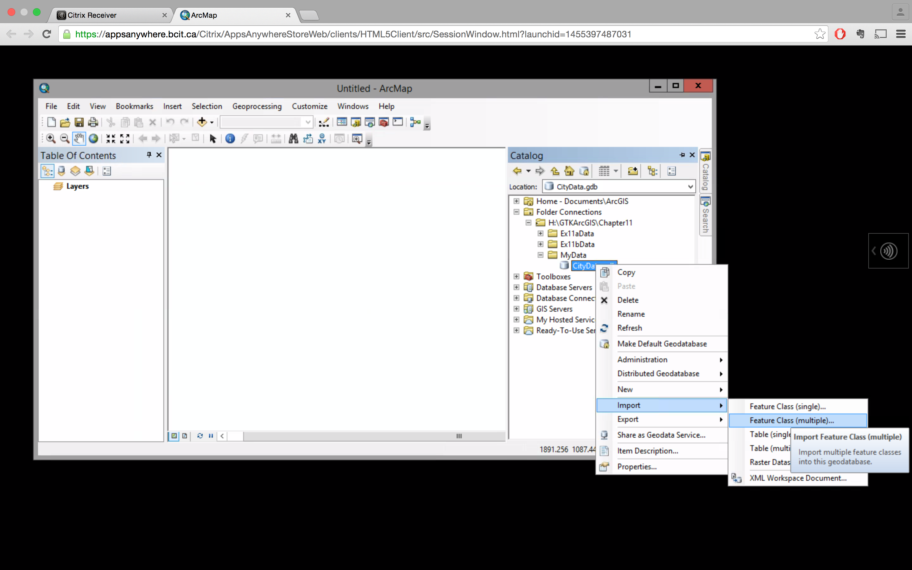

##### 5. Drag all shape files from Ex11aData folder to the window.

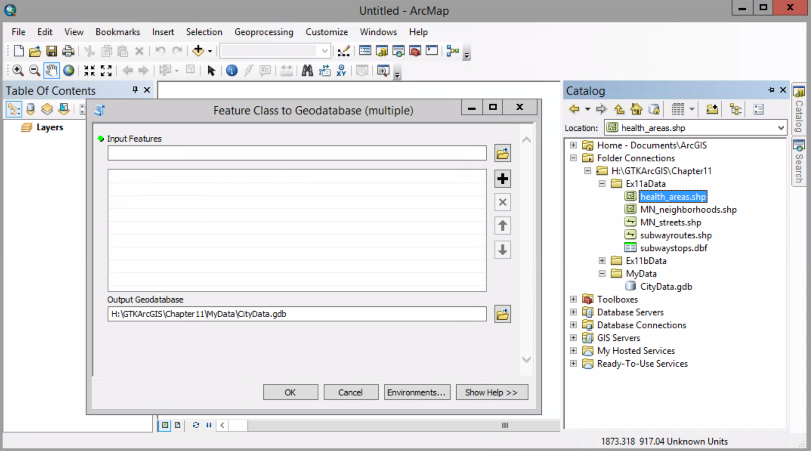

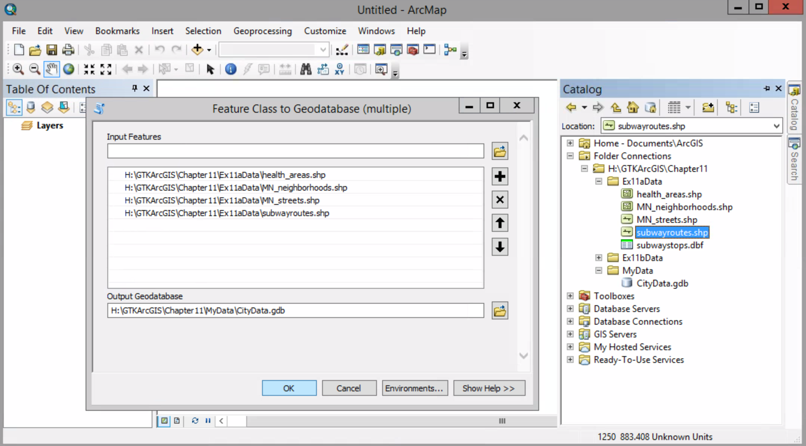

##### 6. Click OK

##### 7. Expand the CityData.gdb to see the new feature classes

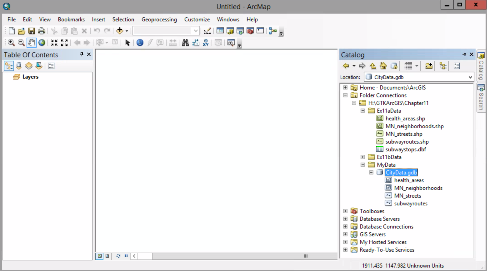

##### 8. Right-click one the feature classes > Item Description. Click the preview tab.

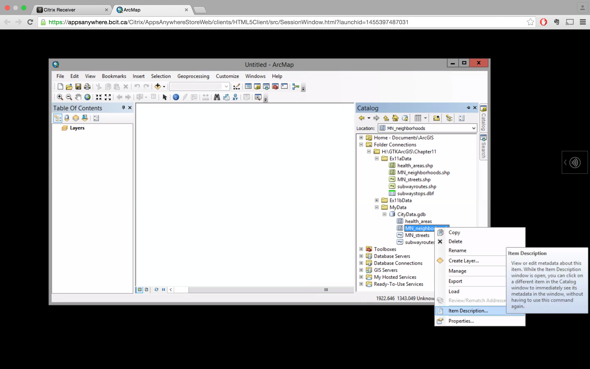

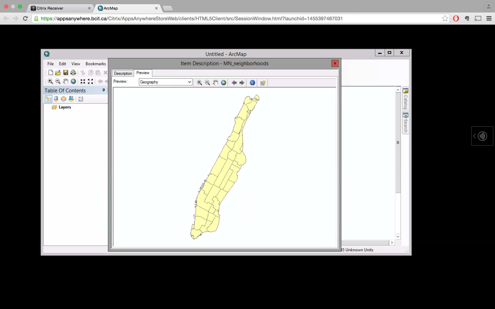

##### 9. Click the other feature classes on the catalog window

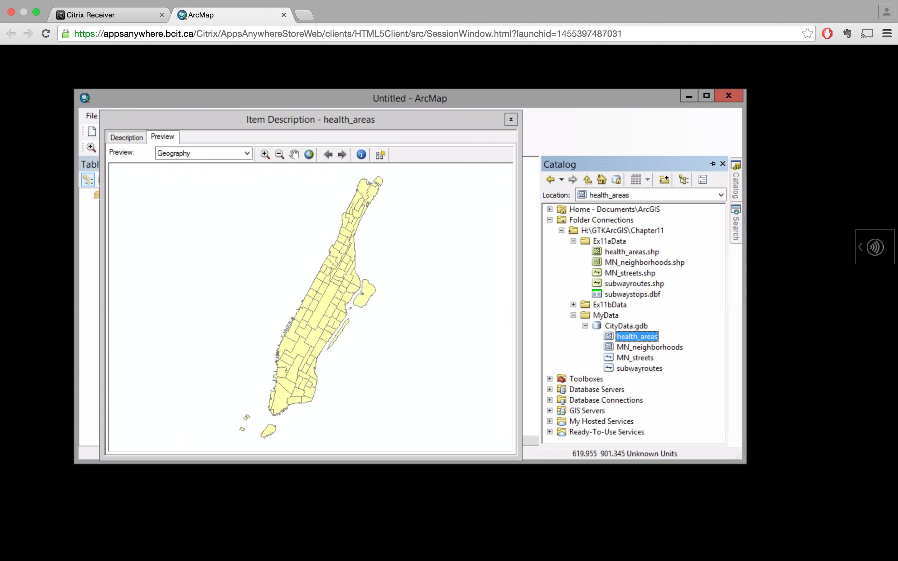

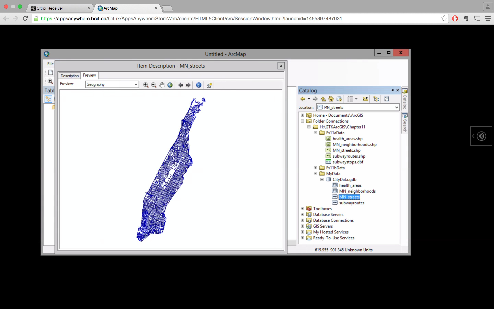

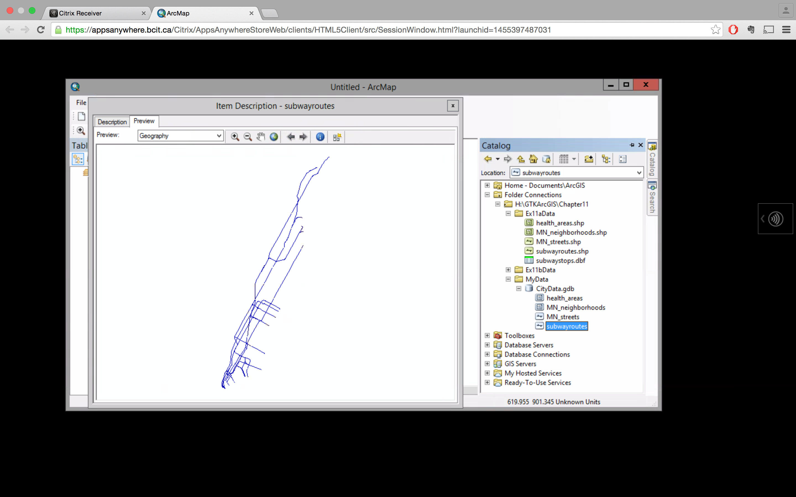

