# Deleting and modifying features

##### 1. Open the map file
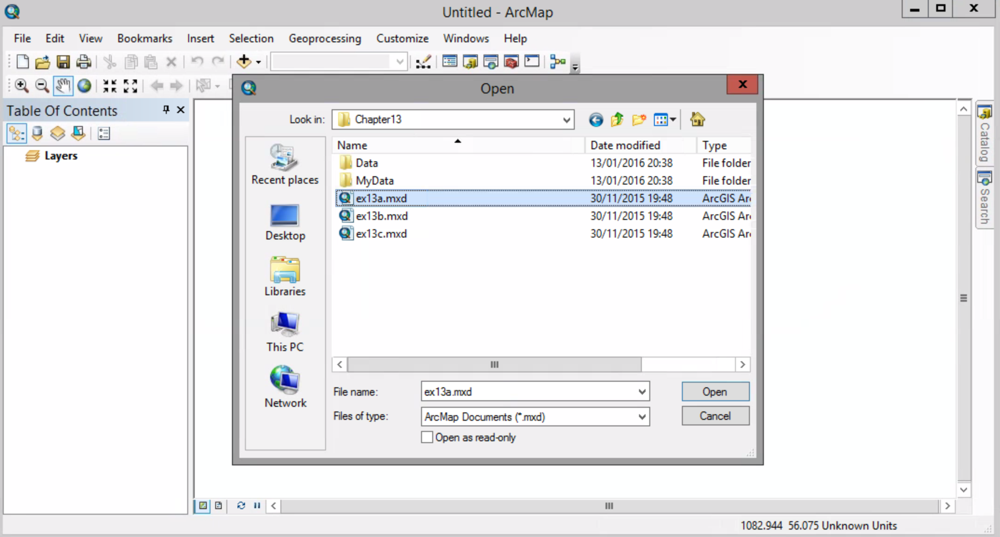

##### 2. Zoom to the playgroung1 and playgroung2 bookmarks. These playgrounds are like the ones you created in chapter 12

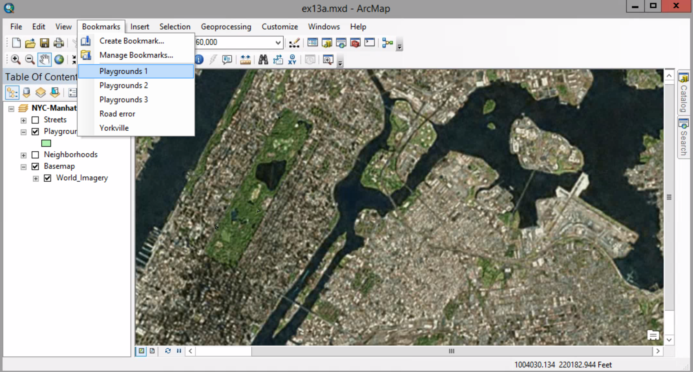

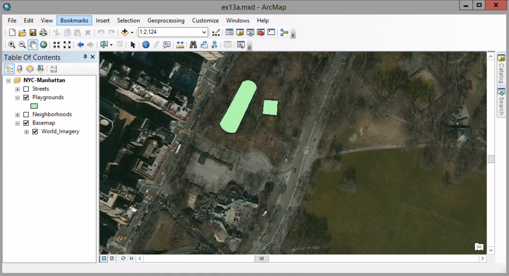

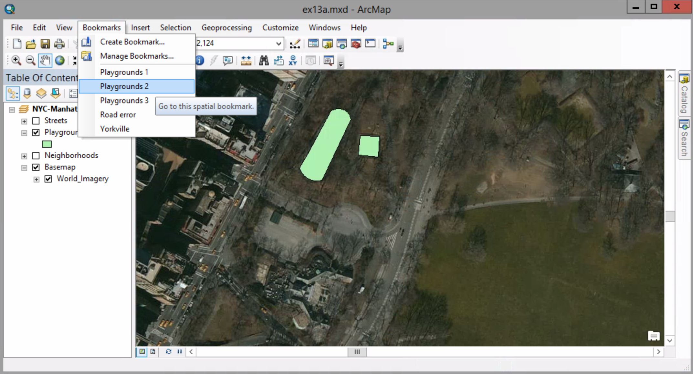

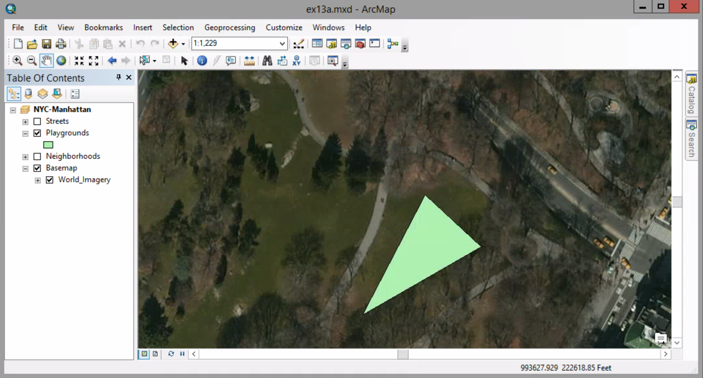

##### 3. Zoom to the playground3 bookmark

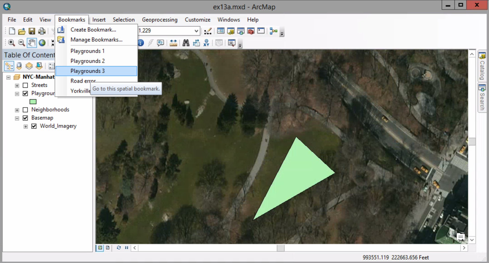

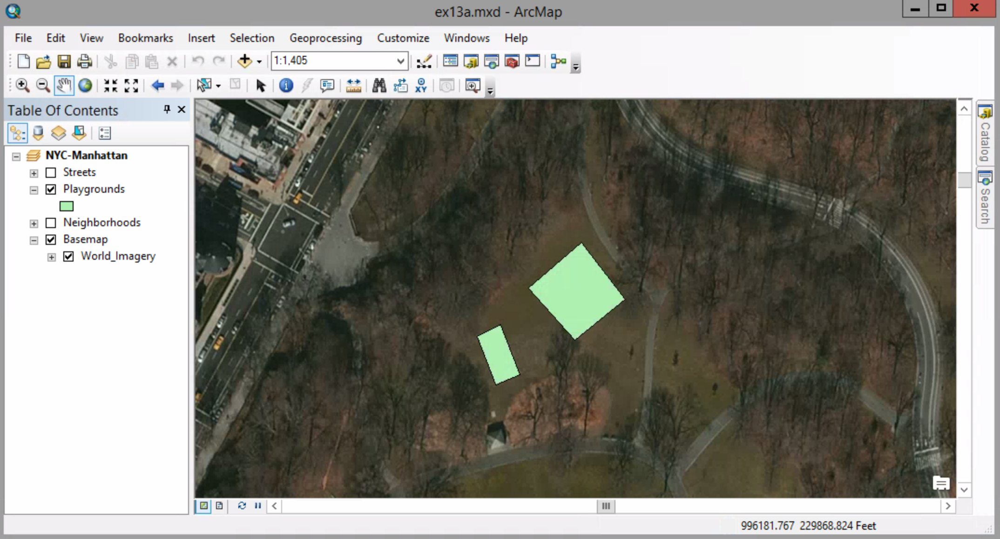

##### 4. Display the Editor toolbar, and start an editing session. Make sure the Edit tool is active

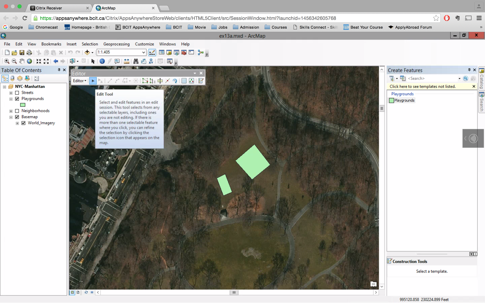

##### 5. Select two playgroungs by Holding down the Shift key.

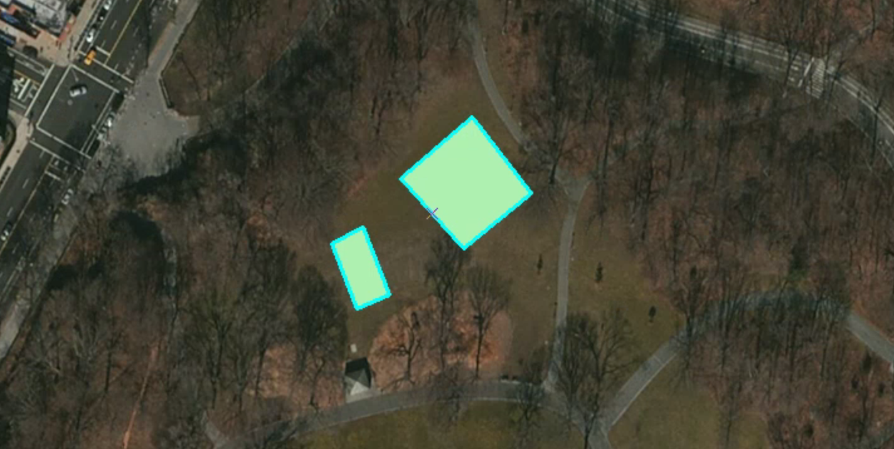

##### 6. Click the Delete button on the standard toolbar.

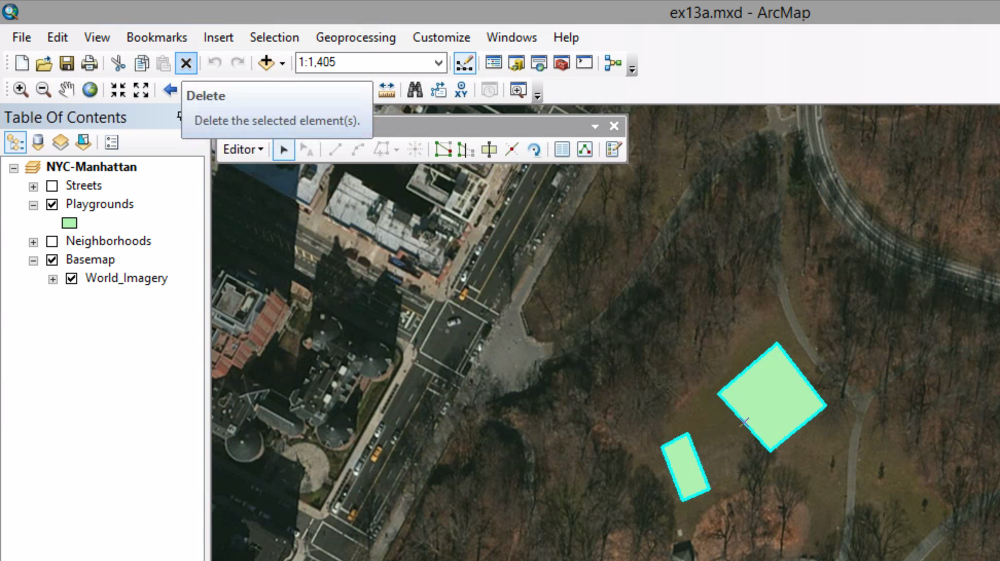

##### 7. Save your edits

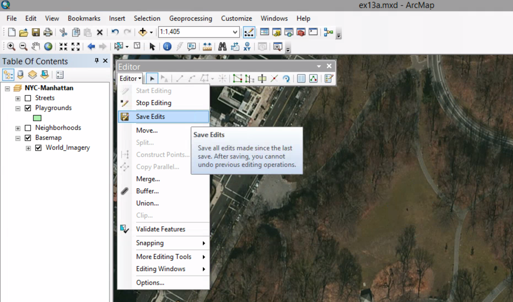

##### 8. Zoom to the Road error bookmark, and turn on the Streets layer.

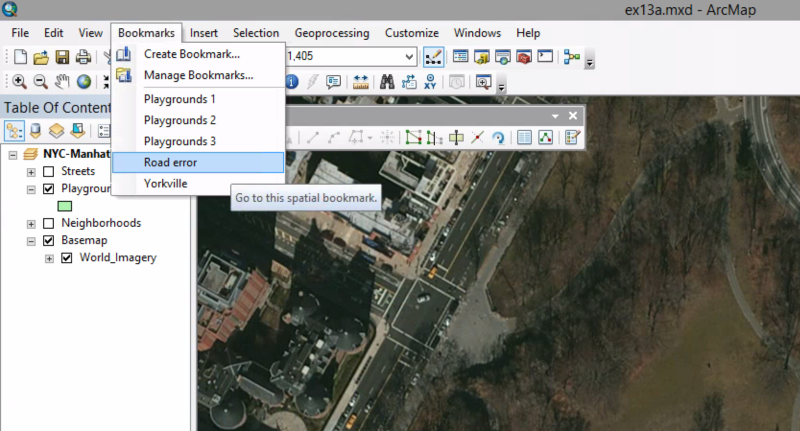

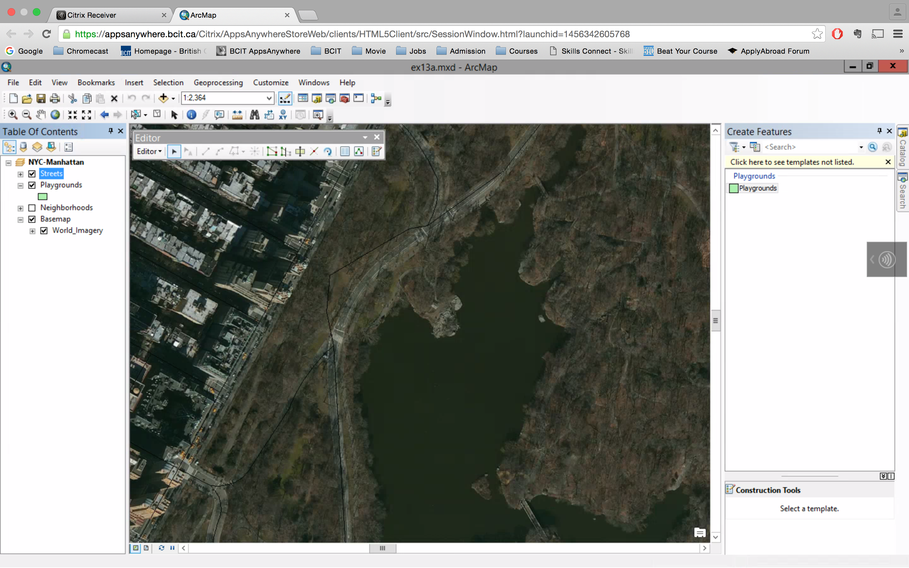

##### 9. Make sure you are still in an edit session. With the Edit tool active, double-click anywhere on the road segment to select it and display its edit sketch.

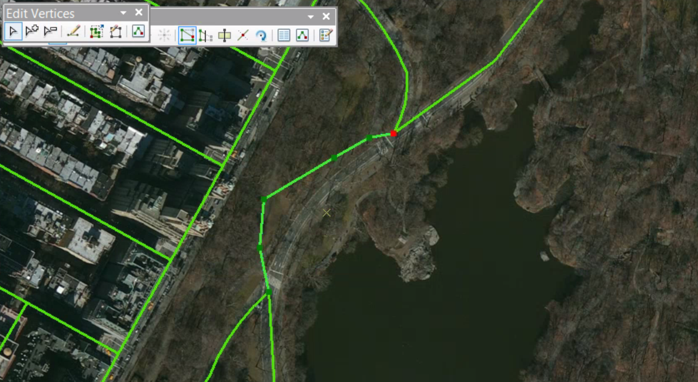

##### 10. Place your pointer over the first vertex to be moved. The pointer becomes a four-headed arrow.

##### 11. Drag the vertex down to the center of the road in the basemap

##### 12. Continue dragging all vertexes

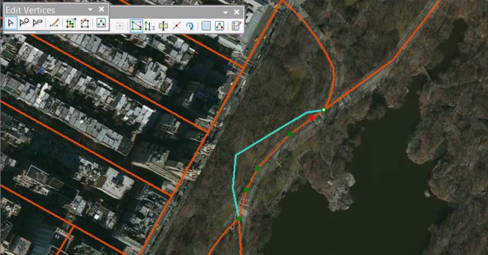

##### 13. On the Edit Verteces toolbar, click Finish Sketch tool

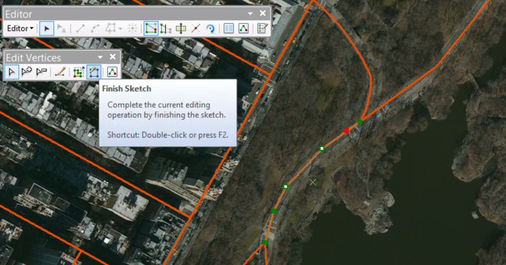

#### 14. Clear the selection, and save your edits.

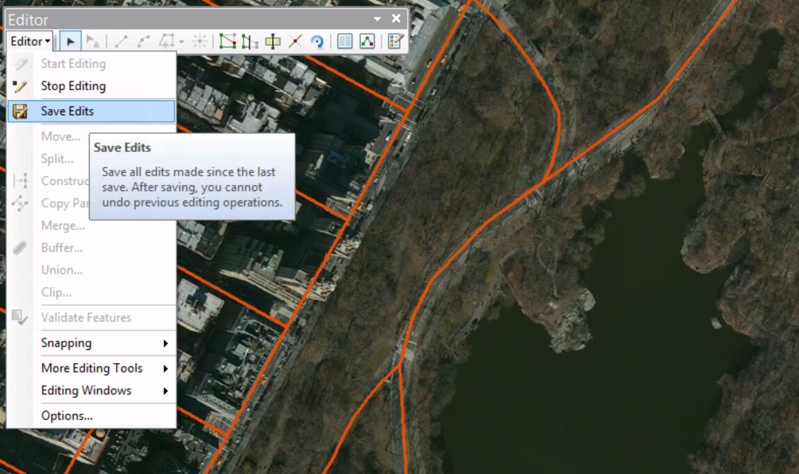

