# Editing Feature Attribute Values

##### 1. Open the ex13c map document.

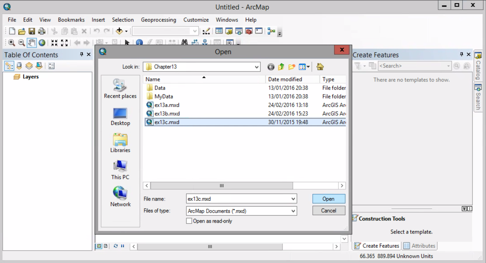

##### 2. Display the Editor toolbar, and start an edit session.

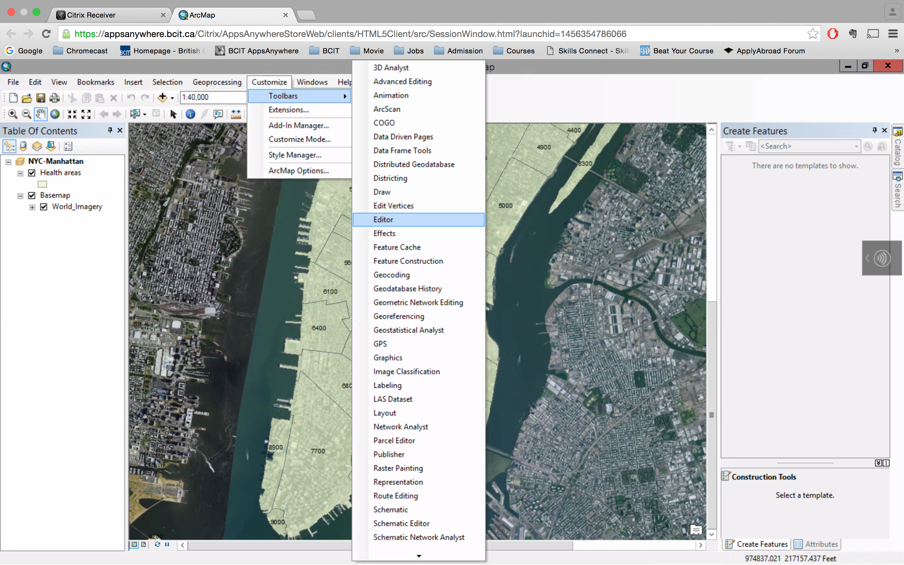

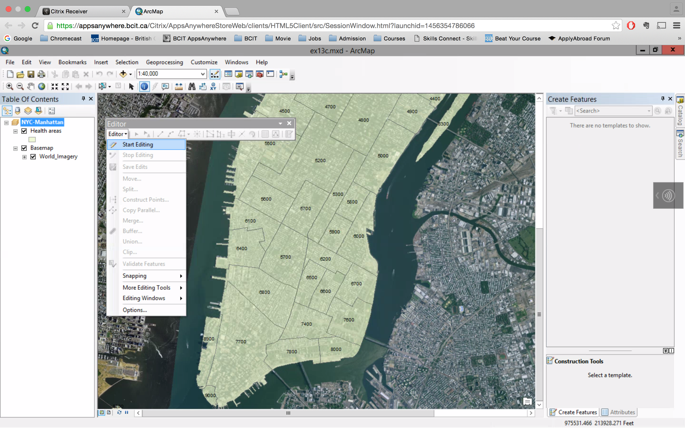

##### 3. With the Edit tool activated, click the smaller health area 5700 to select it.

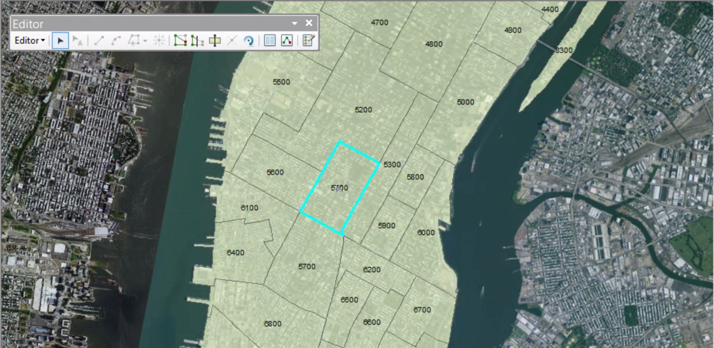

##### 4. Open the Health areas attribute table. Click the Show selected records button.

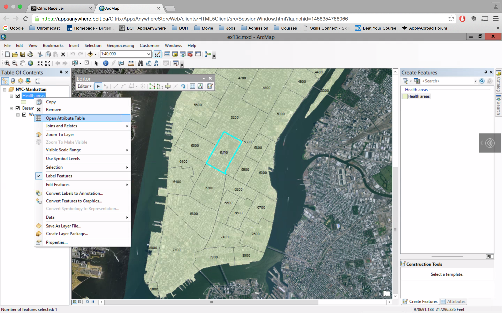

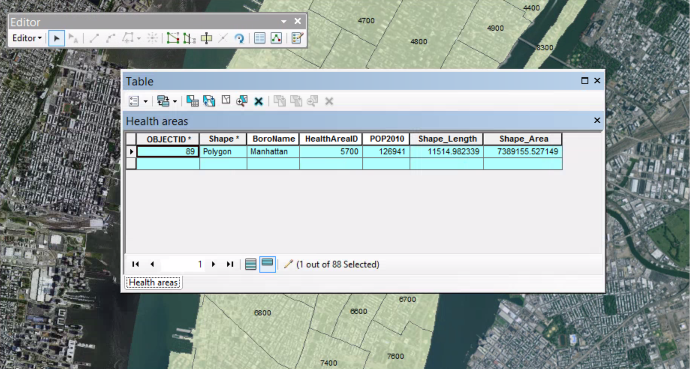

##### 5. Click in the cell under the HealthAreaID field. Highlight and delete the existing value of 5700. Type 5750, and press Enter.

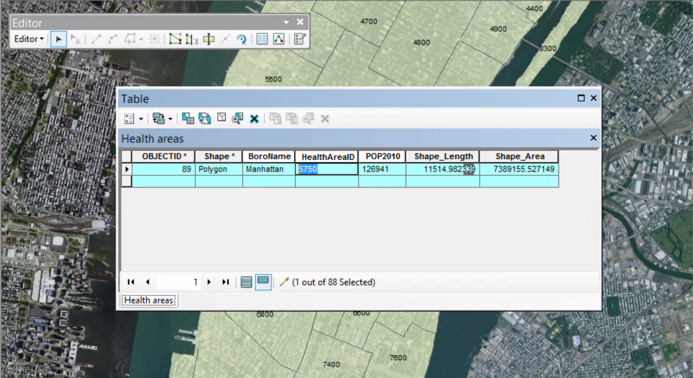

##### 6. Click Editor > Stop Editing. Click yes to save your edits. 

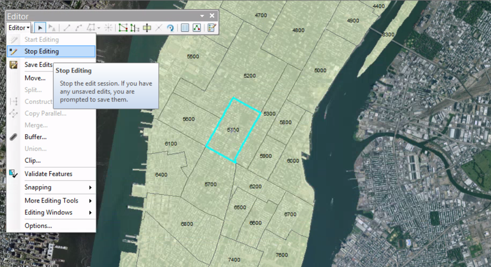

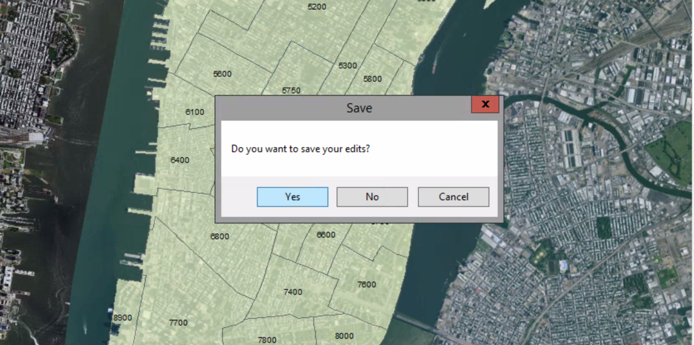

##### 7. Click the Show all records button.

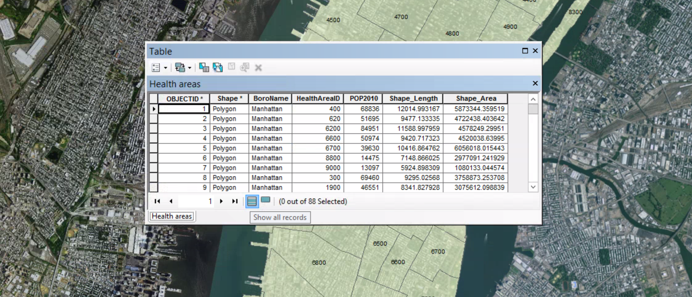

##### 8. At the top of the table, click the Table Options arrow and click Add Field.

##### 9. On the Add Field dialog box, in the Name box, type Acres. Click Type arrow and click Float. Click OK.

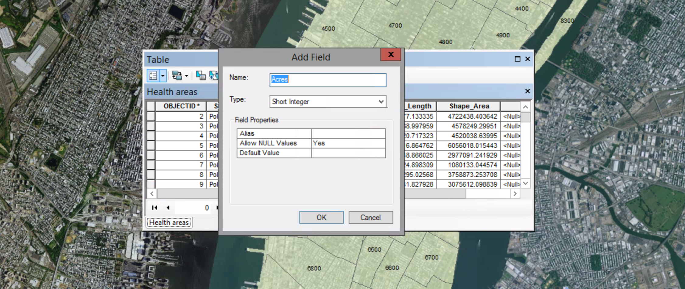

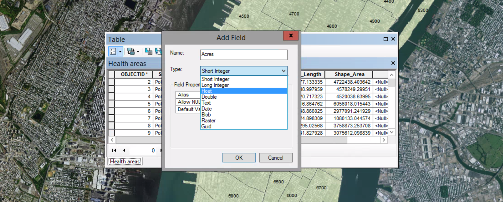

##### 10. In the attribute table, right-click the Acres field name and click Filed Calculator.

