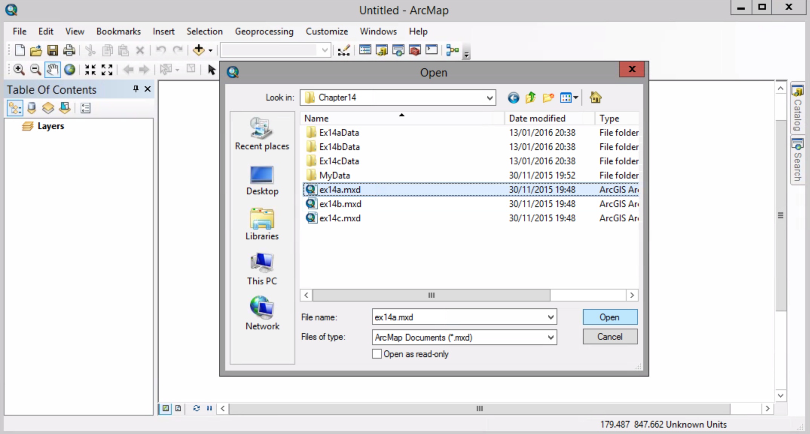
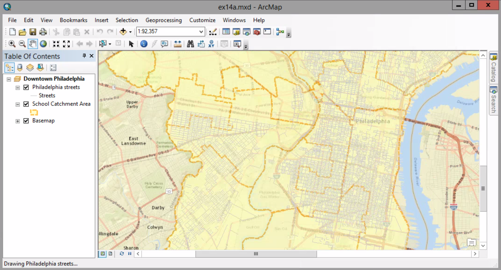
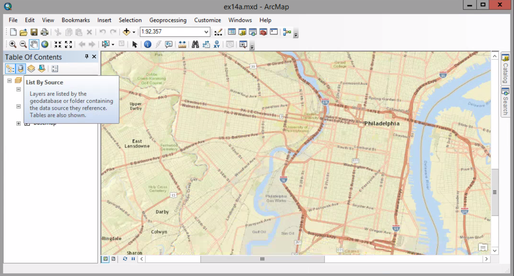

# Creating an Address Locator

##### 1.Open the ex14a map document.

##### 2. At the top of the table of contents, click the List By Source button.

##### 3. Open the School table.

##### 4. Open the table for the Philadelphia streets layer.

##### 5. Open the Catalog window in ArcMap.

##### 6. Navigate to \Chapter14\MyData. Right-click MyData and click New > Address Locator.

##### 7. 