# Rematching Addresses

When you geocode at the street address level, it is common to have addresses that aren't matched.

##### 1. Open the ex14c map document.

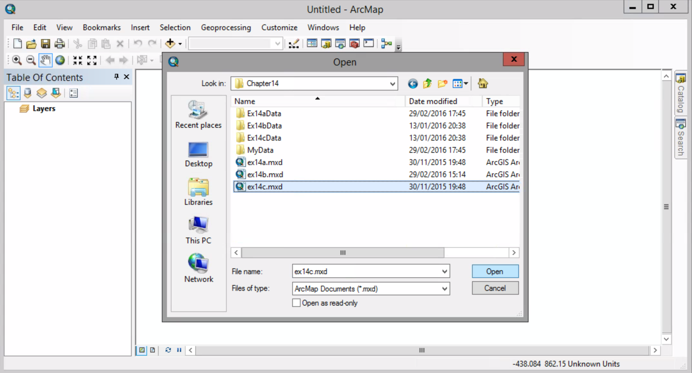

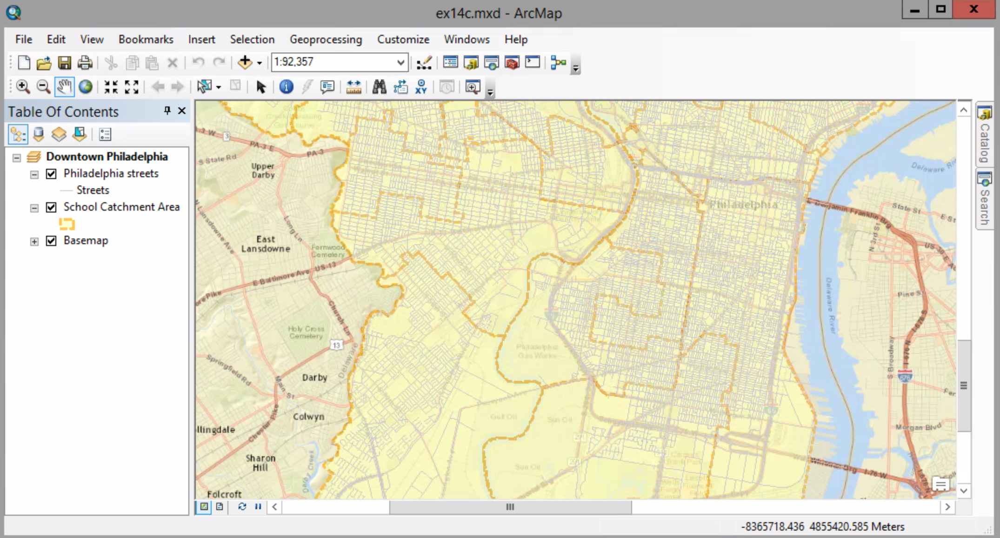

##### 2. Click the Add Data button to add Geocoded_Schools.shp from the MyData folder which you created before in Ex.14b. If a Warning dialog box appears, click Close.

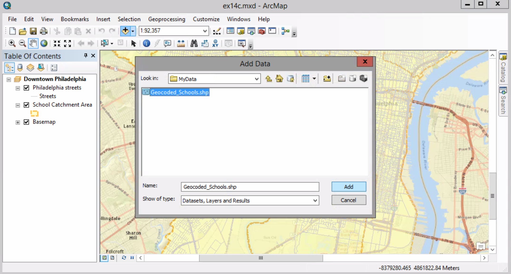

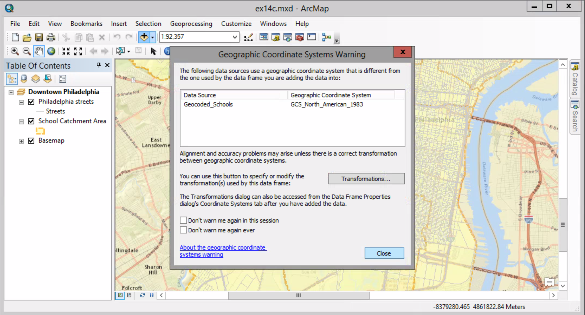

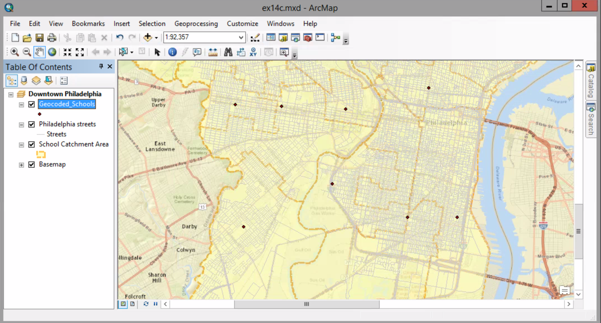

##### 3. In the table of contents, make sure the Geocoded_Schools layer is highlighted. Open the Geocoding toolbar, and click the Review/Rematch Address button.

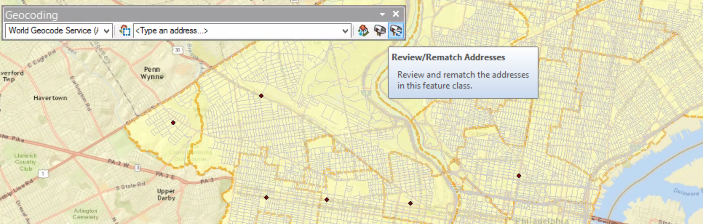

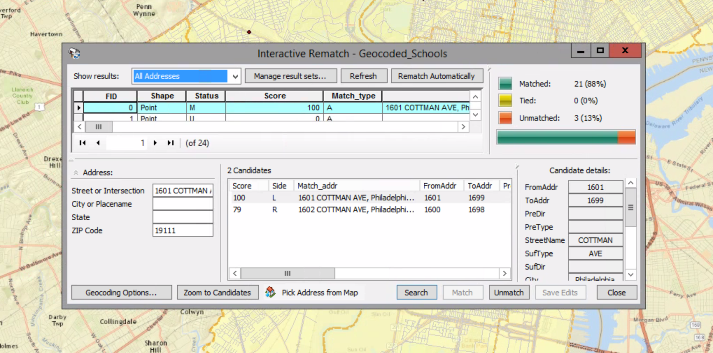

Here you see the results from Ex.14b.

##### 4. Click the Show results arrow and click Unmatched Addresses. Horizontally scroll to the right to see the actual addresses of the Unmatched records.

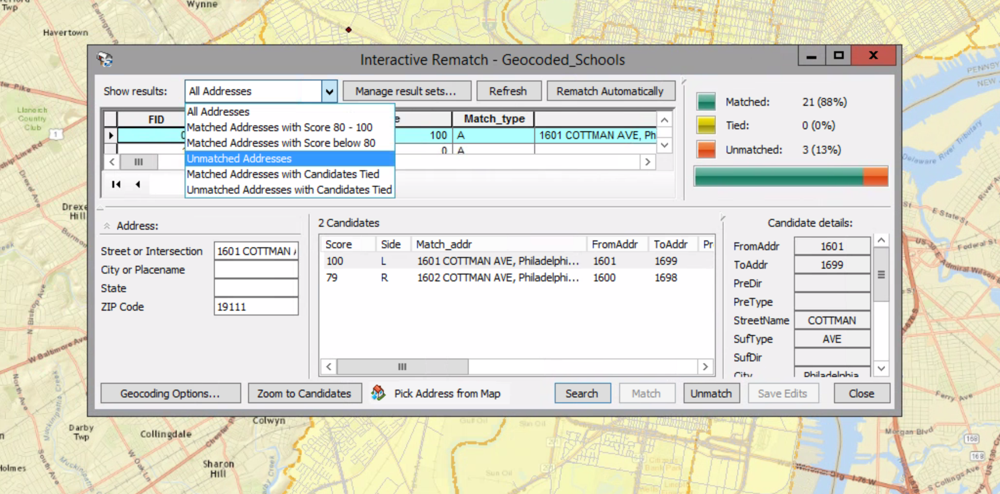

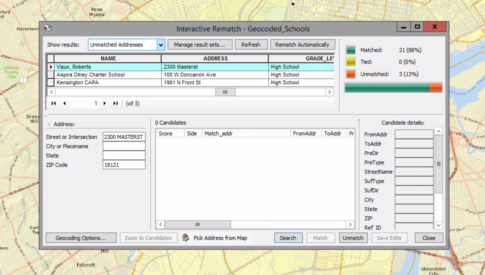

##### 5. Ensure the record with the address "2300 Masterst" is selected. In the Address panel, insert a space in between the R and ST. And press Enter.

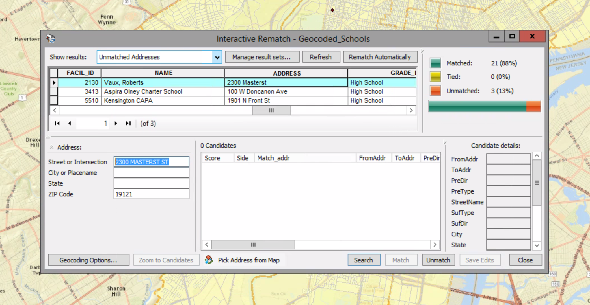

##### 6. Make sure the candidate is highlighted and click Match.

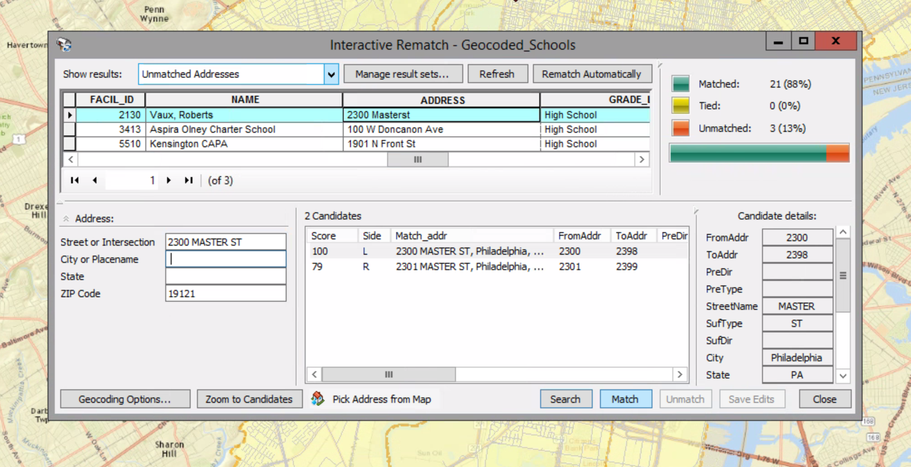

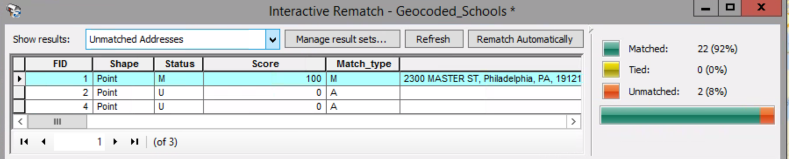

The candidate is matched now.

