# Selecting anf Finding Features

##### 1. Open the map document.

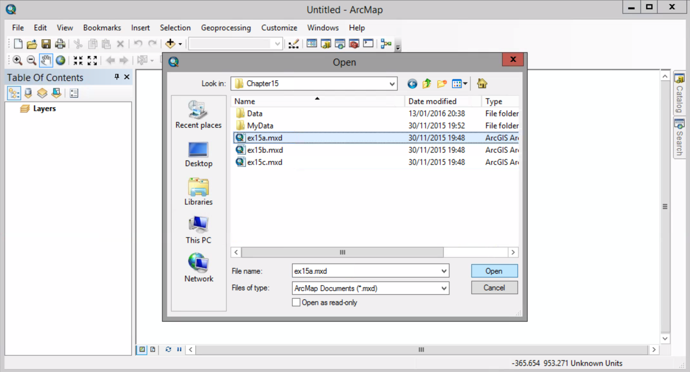

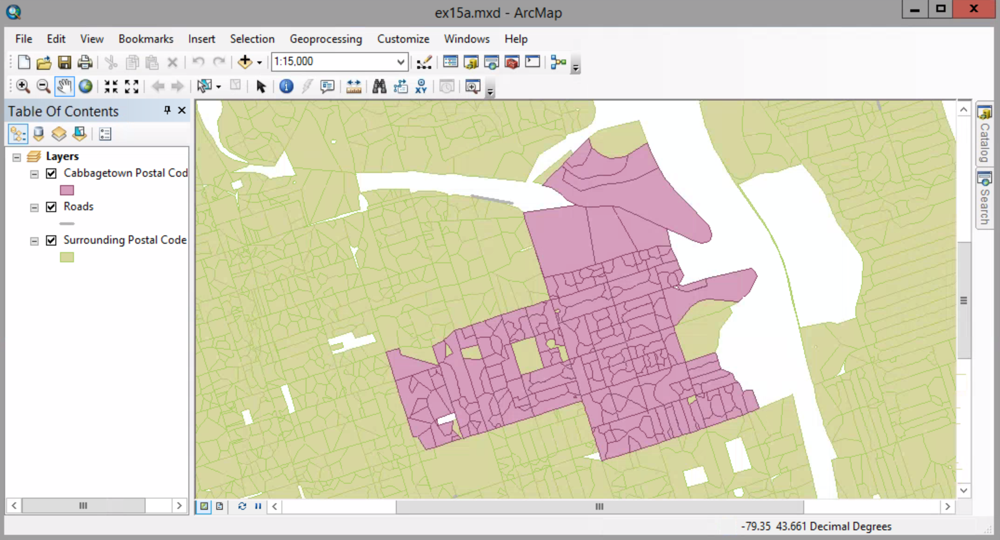

##### 2. Click the HTML Pop-up tool. The mouse pointer becomes a hand and pointer finger.

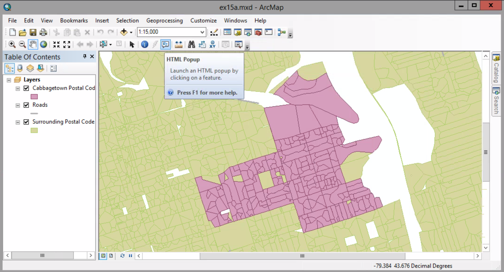

##### 3. On the map, click a postal code feature.

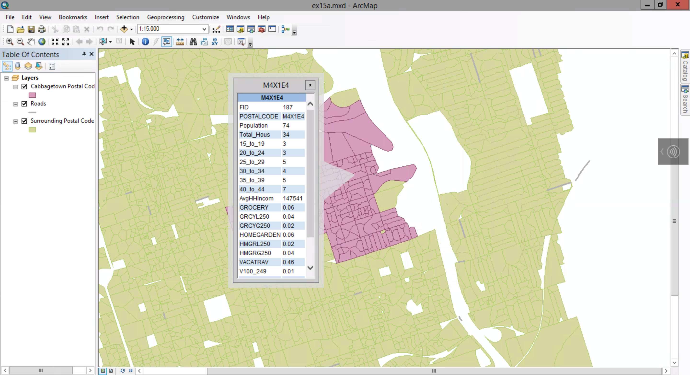

The HTML pop-up window displays the feature's attribute values. 

##### 4. Click a few more postal code areas. A new HTML pop-up window appears each time you click a feature. Arrange them side by side.

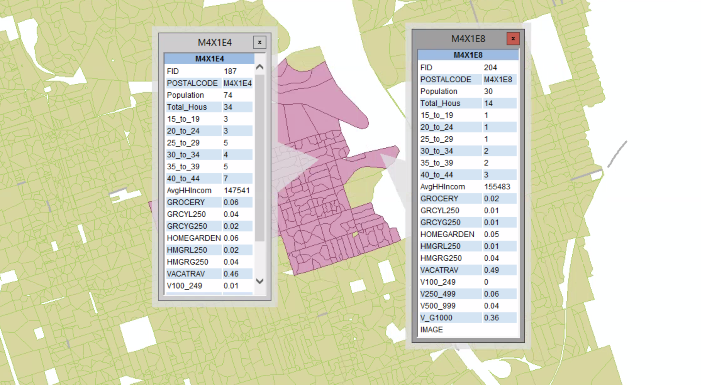

##### 5. Close the HTML pop-up windows. In the table of contents, click the List By Selection button.

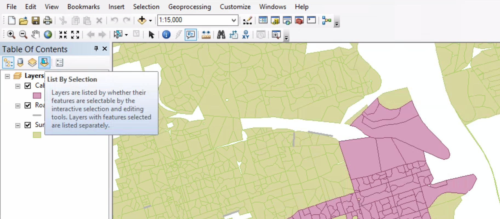

##### 6. For both the Roads and Surrounding Postal Code Area Layers, click the toggle key to make them not selectable.

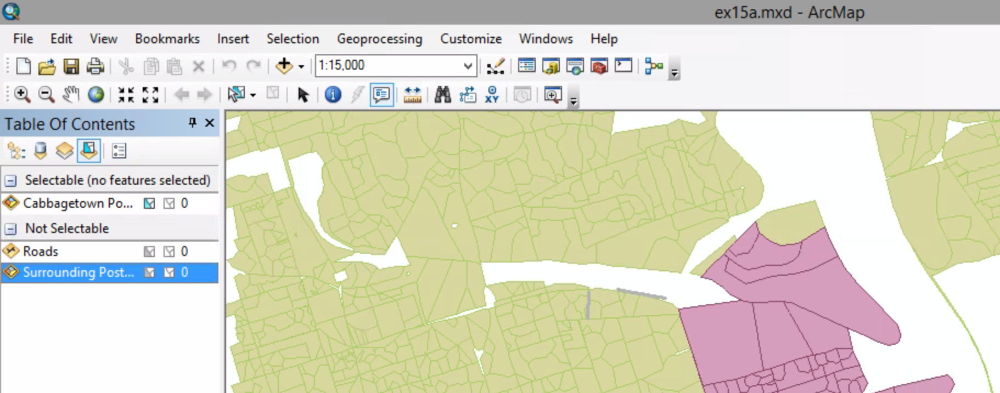

##### 7. Selection menu > Selection Options.

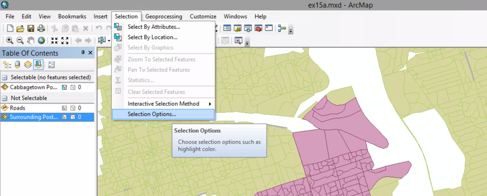

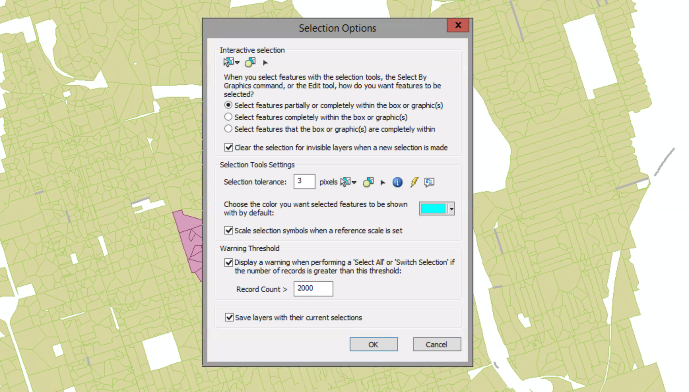

On the Selection Option dialog box, the selection tolerance is set to 3 pixels. Because you are working with small features, you will reduce it.

##### 8. Reduce the selection tolerance from 3 to 0, and click OK.

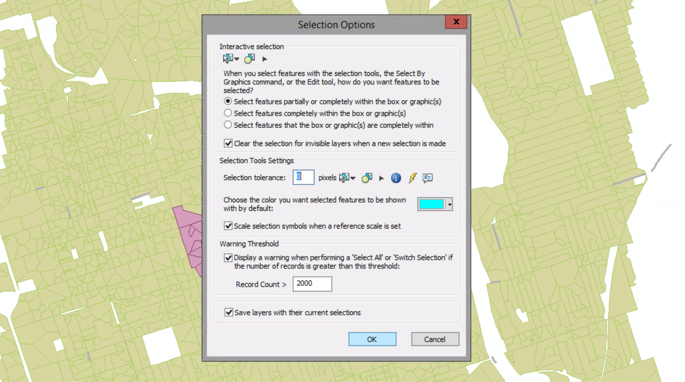

##### 9. Selection menu > Interactive Selection Method > Add to Current Selection

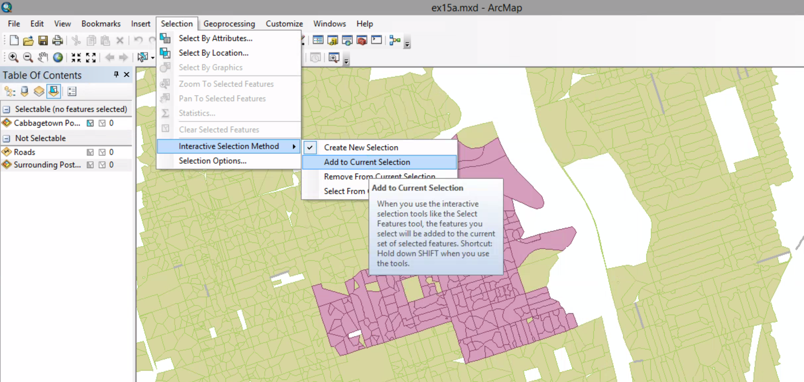

The Add to Current Selection option allows you to click features without the need to press and hold Shift.

##### 10. Click the Select Features tool.

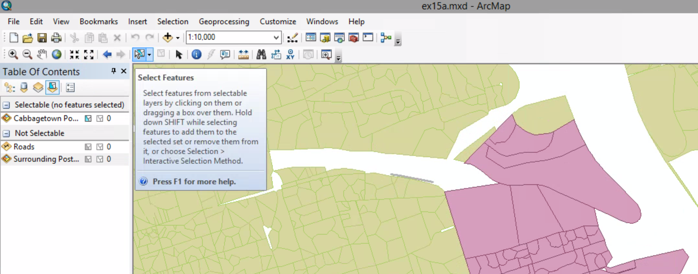

##### 11. On the map, click the postal code areas shown in the graphic, one at a time. The table of the contents shows how many postal codes are selected and the name of each postal code.

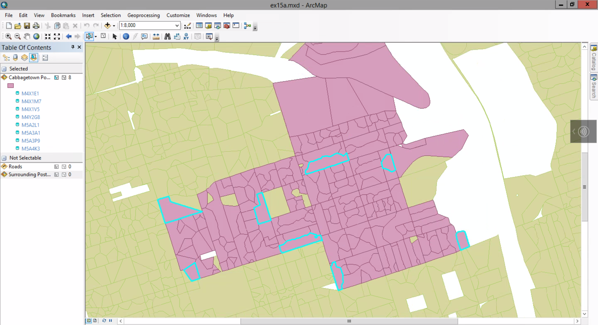

