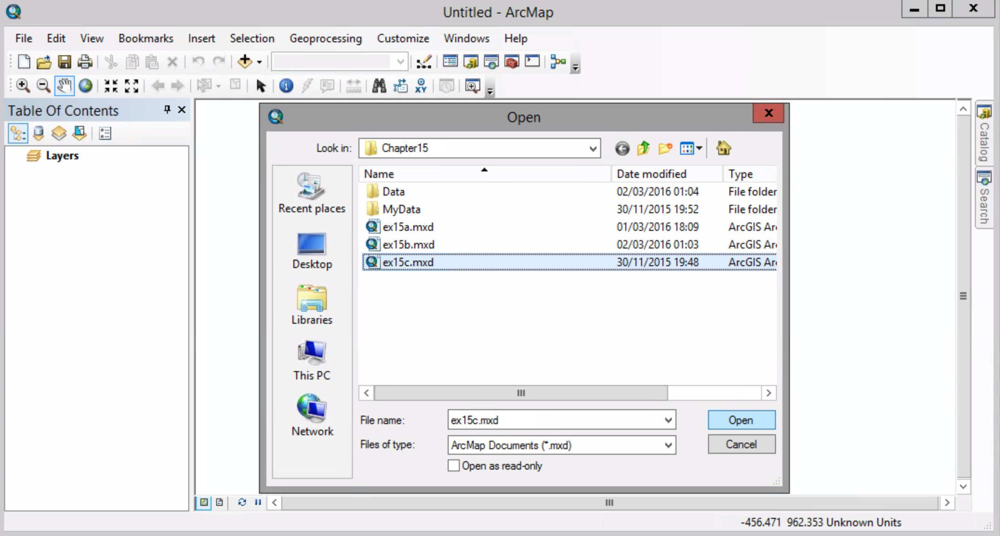
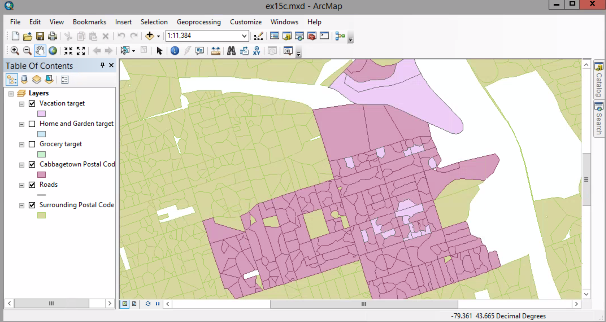
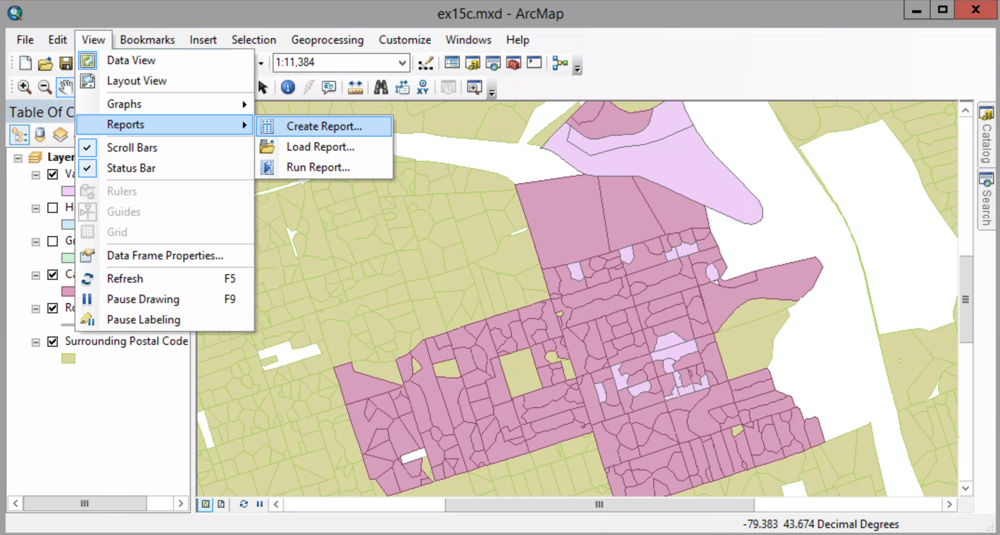
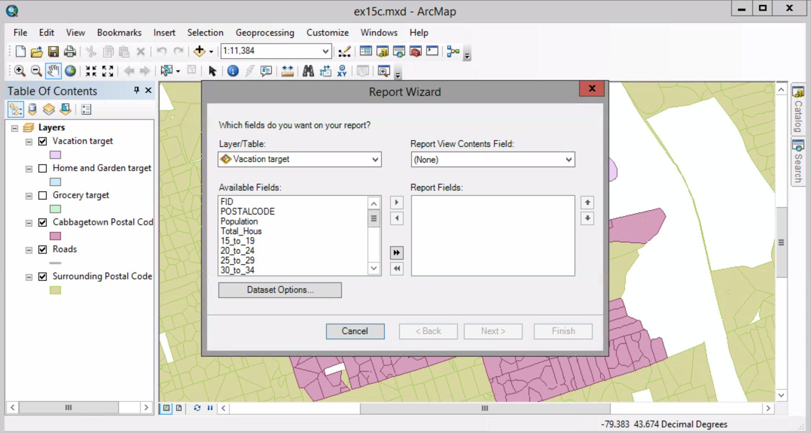
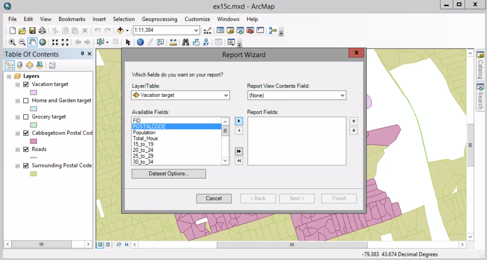
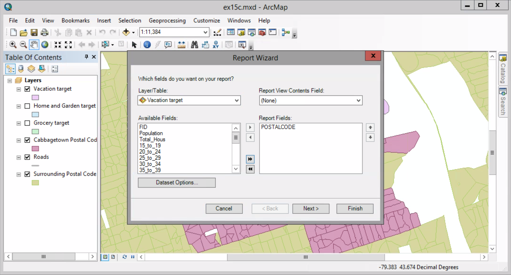
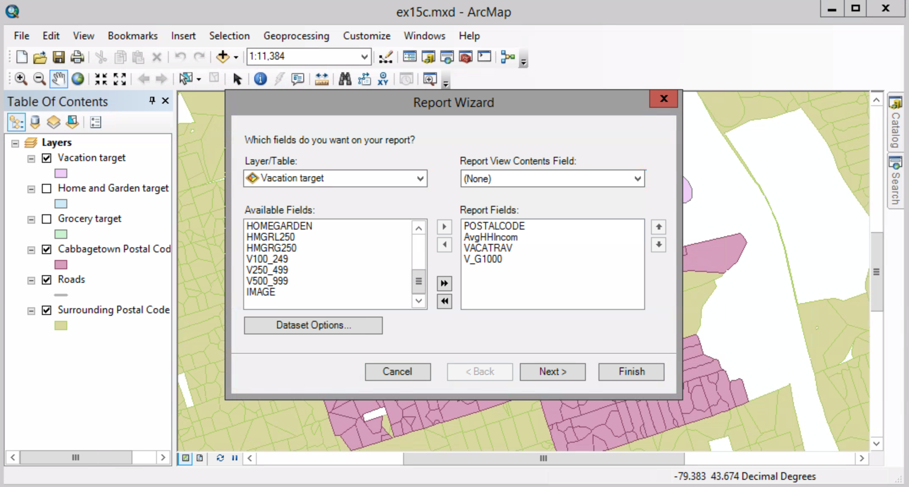
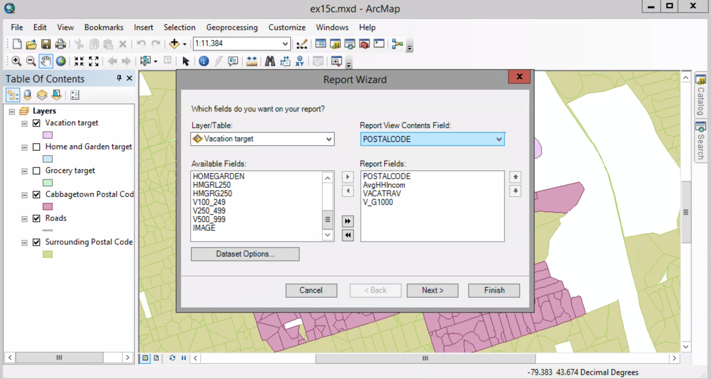

# Creating Reports

##### 1. Open the map document.

##### 2.  View menu > Reports > Create Report.

##### 3. Make sure the Layer/Table list shows Vacation target. In the Available Fields list, click POSTALCODE. Click the Add field button.

##### 4. Add some others as you see on the graph.

##### 5. Click the Report Viewer Contents Field arrow and click POSTALCODE. This means this field will be displayed when you preview the report.

