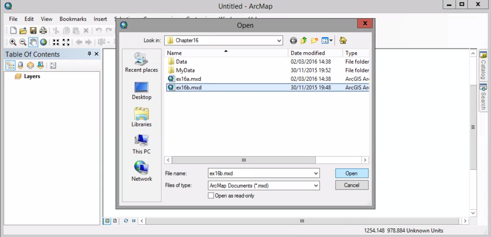
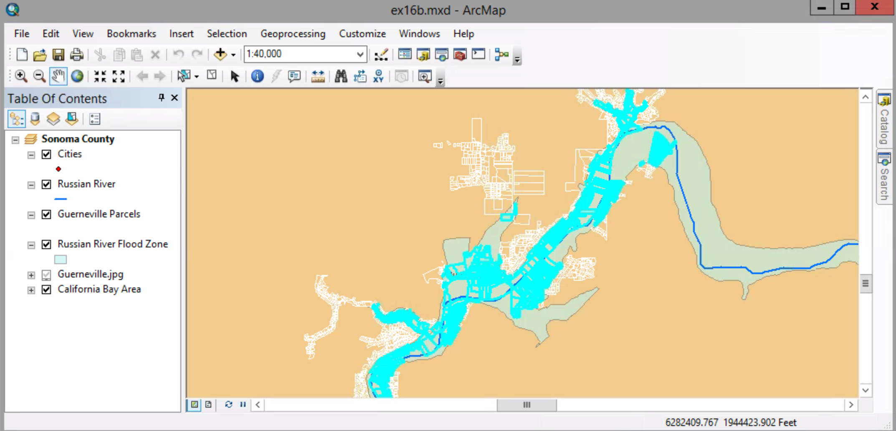
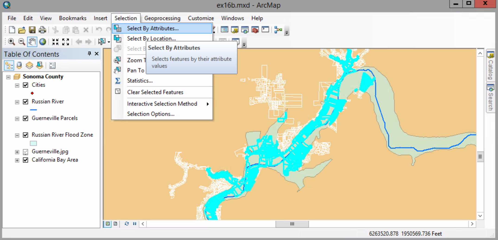
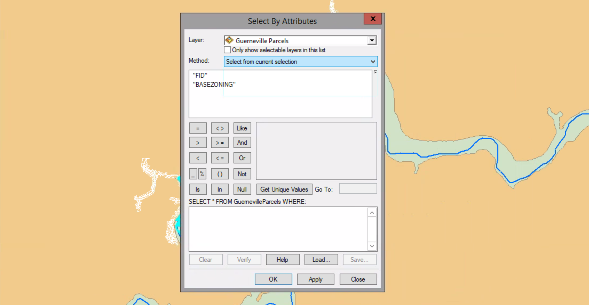

# Combining attribute and location queries

##### 1. Open the map document.

##### 2. Active "Select By Attribute" dialog box.

##### 3. Do these settings:
##### Layer --> Gueneville Parcels
##### Method --> Select from current selection

