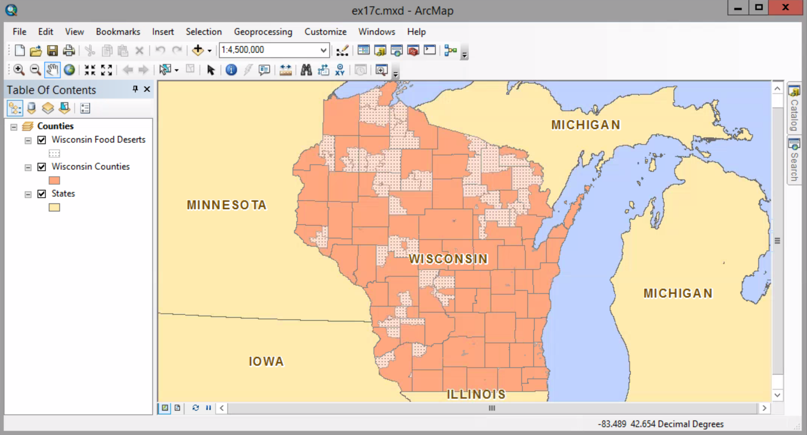
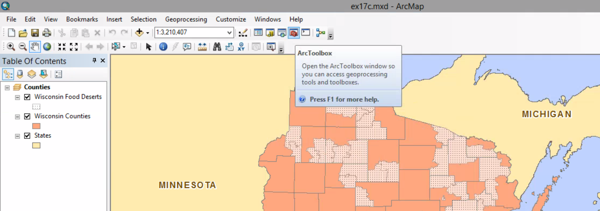
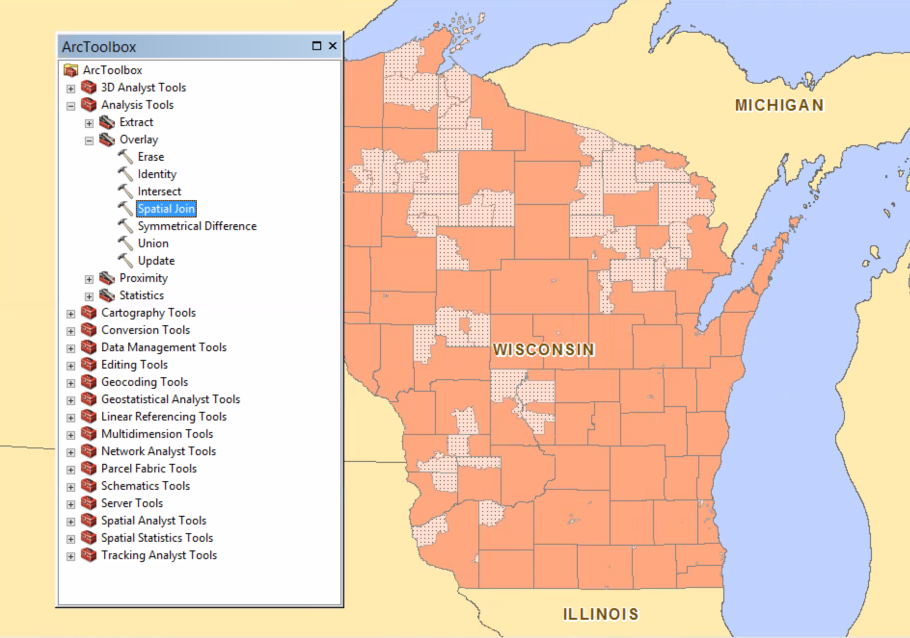
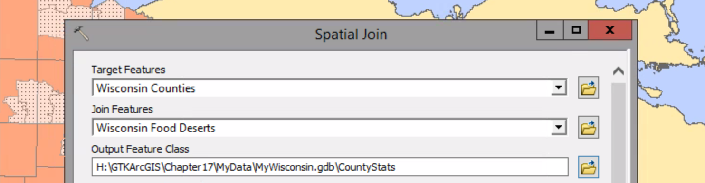
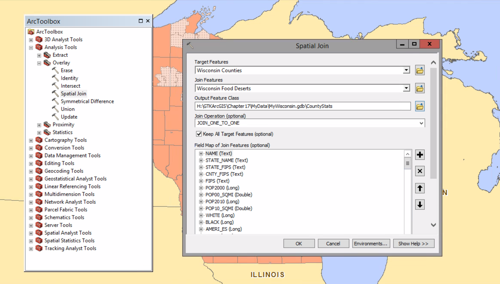
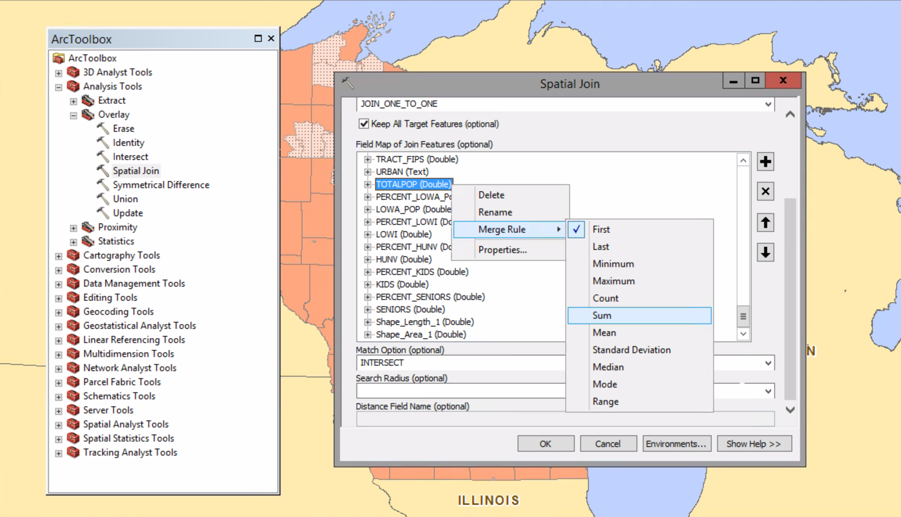
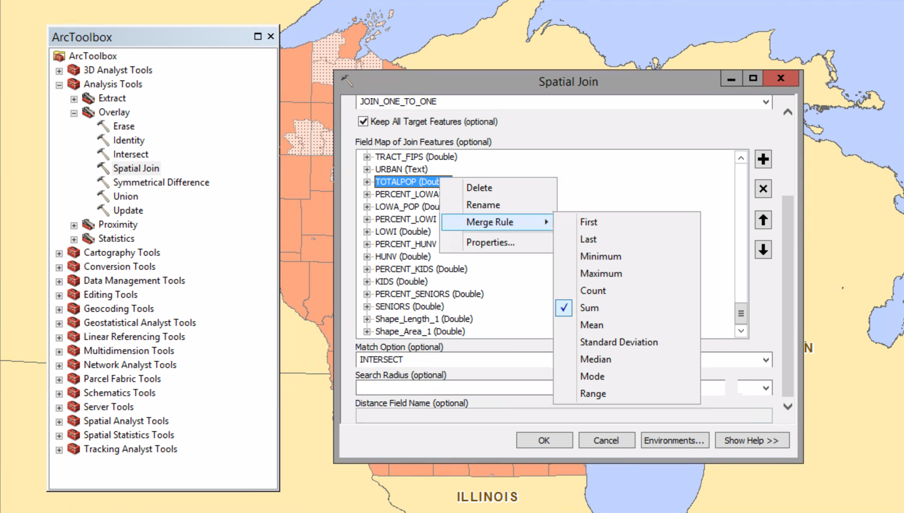
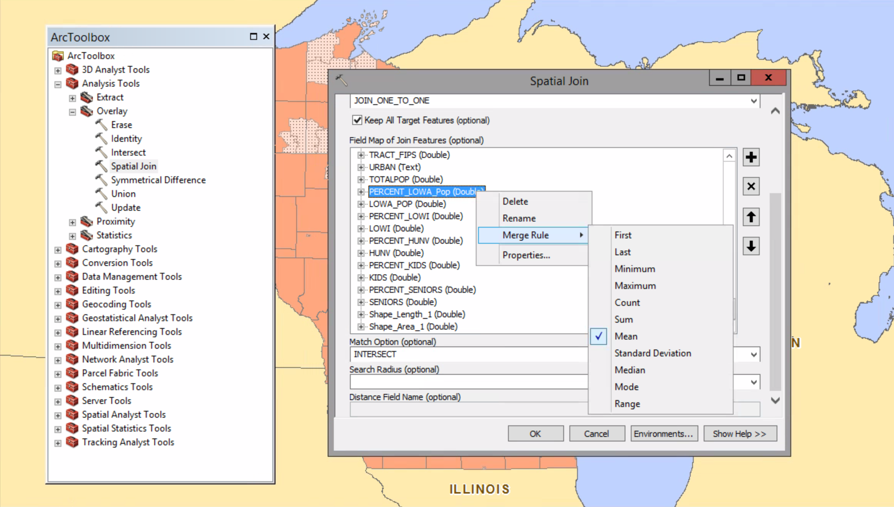
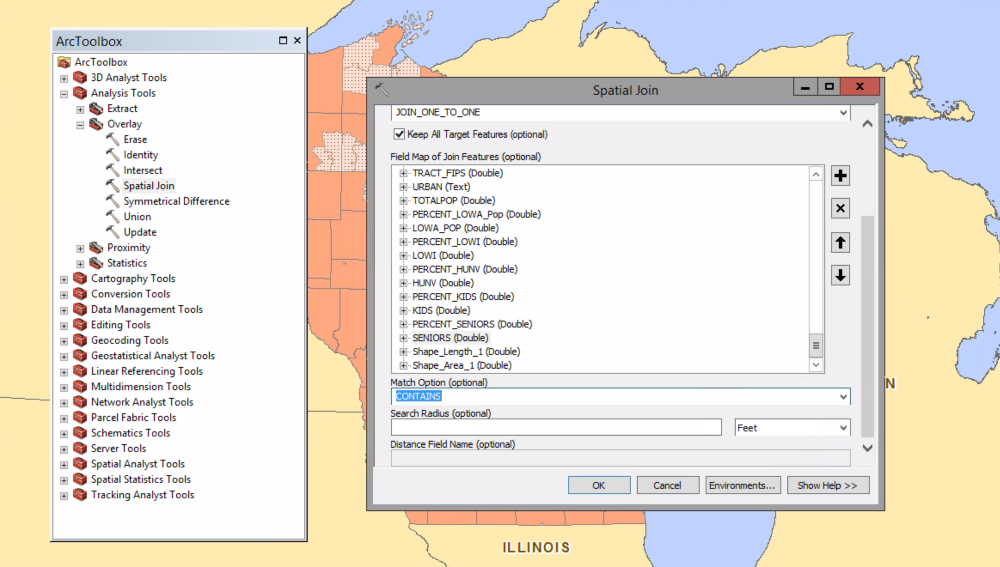
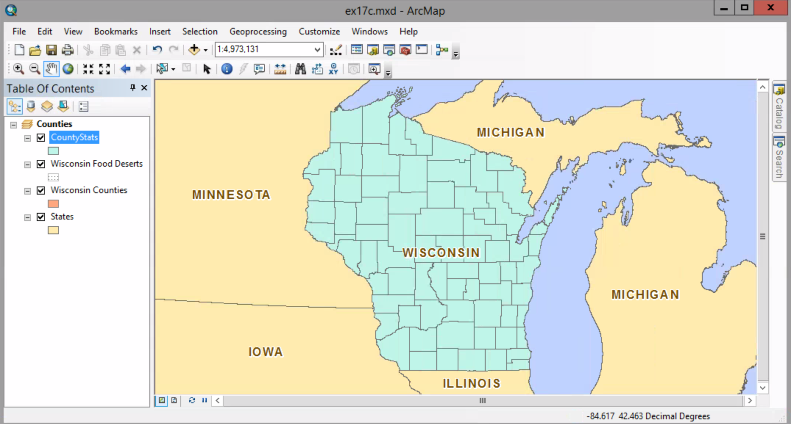

# Joining data by location

In this exercise you will create a spatial  join based to combine two spatial layer. Specifically, you want to create a spatial join base on a containment relationship between two polygon layers.

##### 1. Open the ex17c map document.

##### 2. On the Standard toolbar, click the ArcToolbox button. Expand the Analysis Tools > Overlay toolset.

##### 3. Open the Spatial tool.

##### 4. On the Spatial Join dialog box:
##### Target Feature --> Wisconsin Counties
##### Join Feature   --> Wisconsin Food Deserts
##### Output Feature Class --> ...\MyData\MyWisconsin.gdb\CountyStats

##### 5. For Join Operation, maintain the default of JOIN_ONE_TO_ONE.

You may wonder why you are using the one-to-one option here. This isn't about cardinality. You have many food deserts that you want to join to each county; however, you want only one row returned for each target feature.

##### 6. Maintain the default for Keep All Target Features. This means even counties without food deserts will remain in the output feature class.

##### 7. In the Field Map of Join Features panel, scroll down until you see the TOTALPOP (Double) field. Right-click it and click Merge Rule > Sum.

The output will now show the sum of all populations that live within the food deserts in each county.

Notice that the default merge rule is "First". This means that when there are multiple join features that share space with a target feature, only the first attribute value will appear in the output table.

##### 8. So you can see the average percentage of those living in food deserts who have low access to grocery stores, change the PERCENT_LOWA_Pop merge rule to Mean. 

##### Then, change the merge rule for the next nine fields, summing the numerical figures and averaging (mean) the percentages (those with field names that begin with PERCENT_).

##### 9. Change the Match Option to CONTAINS.

The Count field - which tallies all join features within each target feature - will be added automatically to the target table.

##### 10. Click OK to run the Spatial Join tool. When the process is completed, the ouput layer is added to the map with a randomly chosen fill color.

