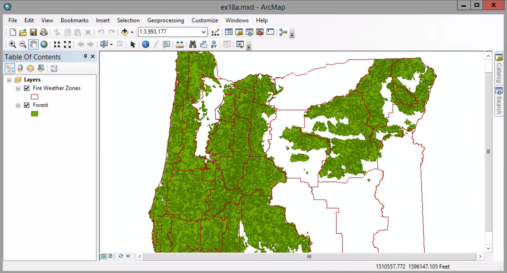
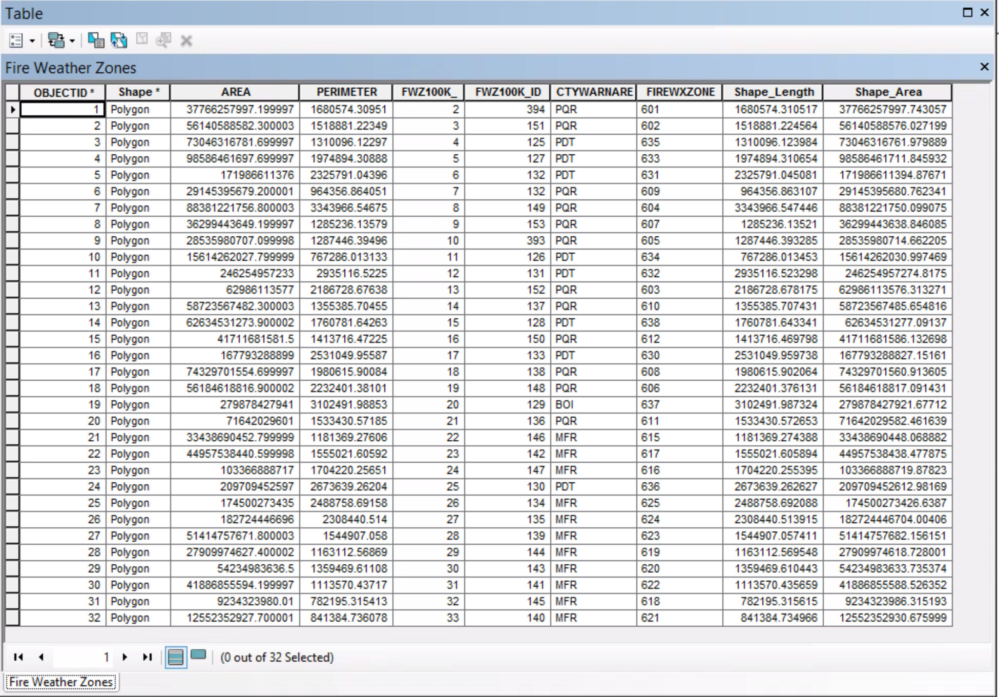
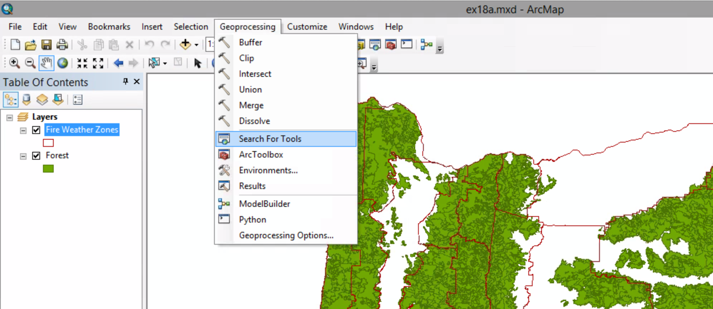
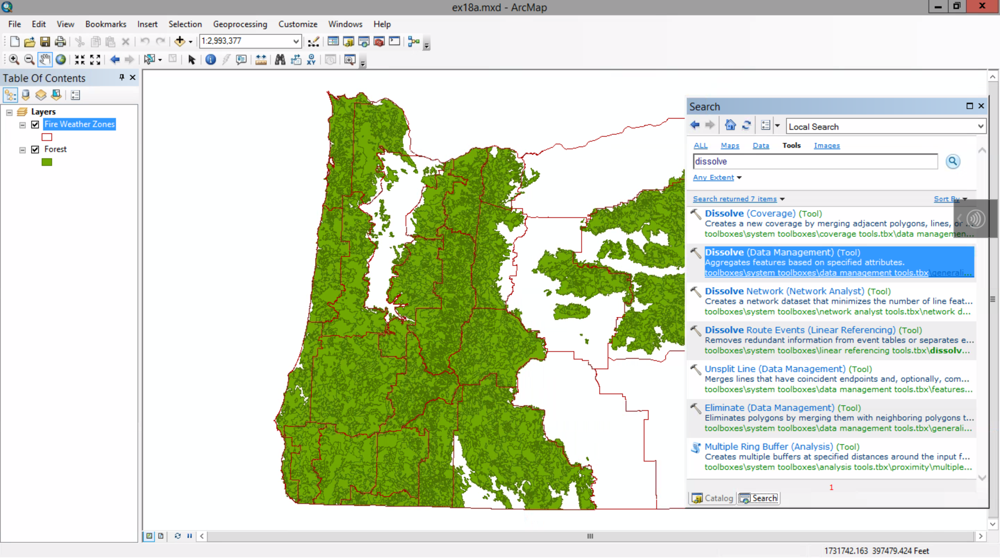
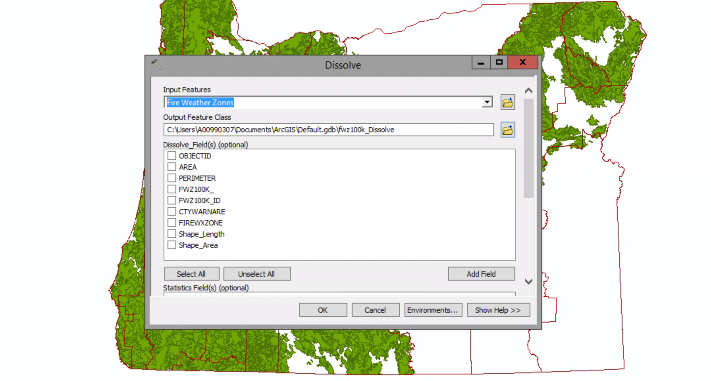

# Dissolving features

##### 1. Open the map document.

##### 2. Open the attribute of the Fire Weather Zones layer.

##### 3. Close the table. 
##### Geoprocessing menu > Search For Tools

##### 4. In the Search window, type dissolve and press Enter.

##### 5. In the Search results, click Dissolve (Data Management). Be sure to click the title to open the tool dialog box.

##### 6. In the Input Features list, click Fire Weather Zones.

