# Running tools in a model

##### 1. Open the ex18d map document.

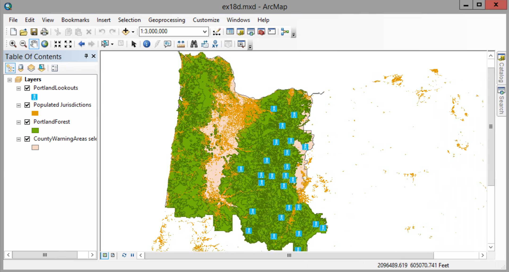

##### 2. In the Catalog window, navigate to your MyData folder for chapter 18. Right-click MyData and click New > Toolbox.

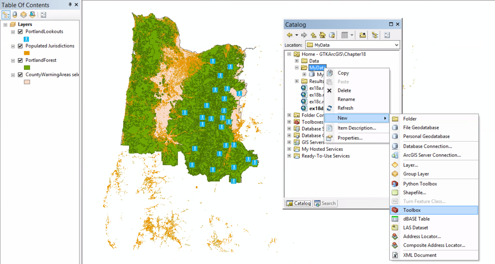

##### 3. In the Catalog window, change the new toolbox name to Oregon Forest Analysis and press Enter. In the Catalog tree, expand your MyData folder if necessary.

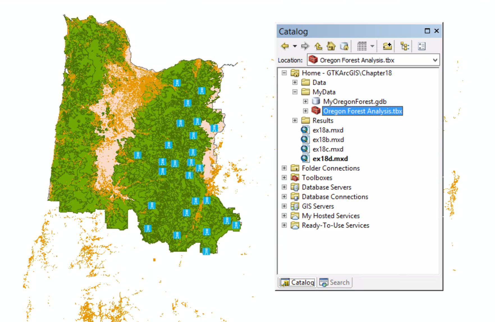

Next, you will create a model within the toolbox.

##### 4. In the Catalog window, right-click the Oregon Forest Analysis toolbox and click New > Model.

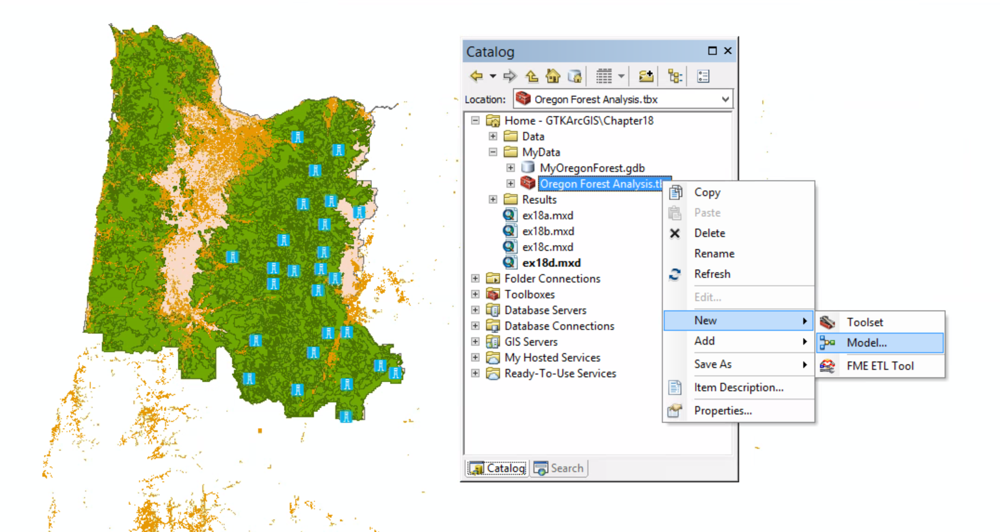

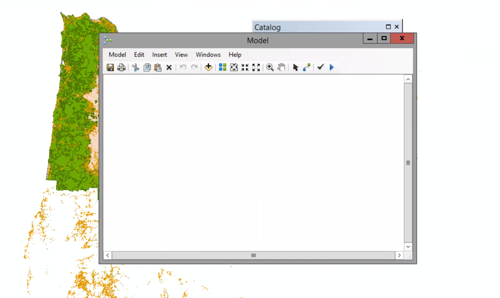

##### 5. On the ModelBuilder menu bar, click Model > Model Properties.
##### On the General tab, in the Name box, replace Model with ForestAnalysis.
##### In the Lable box, replace Model with Forest Analysis. Click OK.

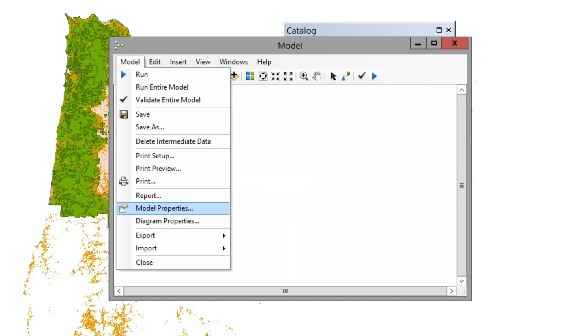

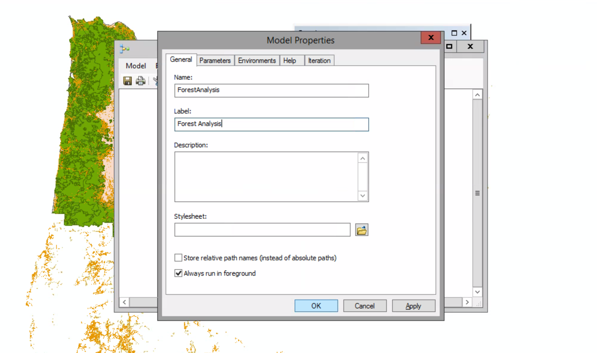

##### 6. On the ModelBuilder toolbar, click the Save button.

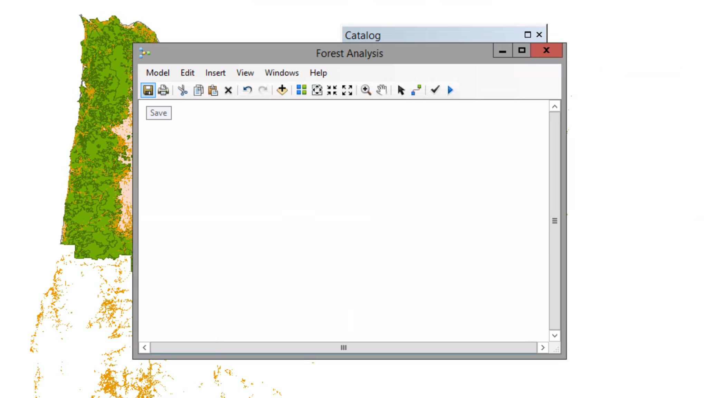

##### 7. Close the ModelBuilder window.

##### 8. In the Catalog window, if necessary, click the plus sign (+) next to the Oregon Forest Analysis toolbox to open it and view the model inside.

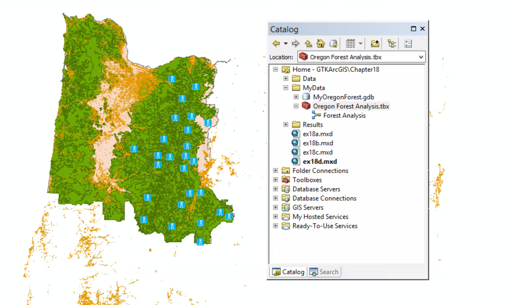

##### 9. On the Standard toolbor, click the ArcToolbox button. 

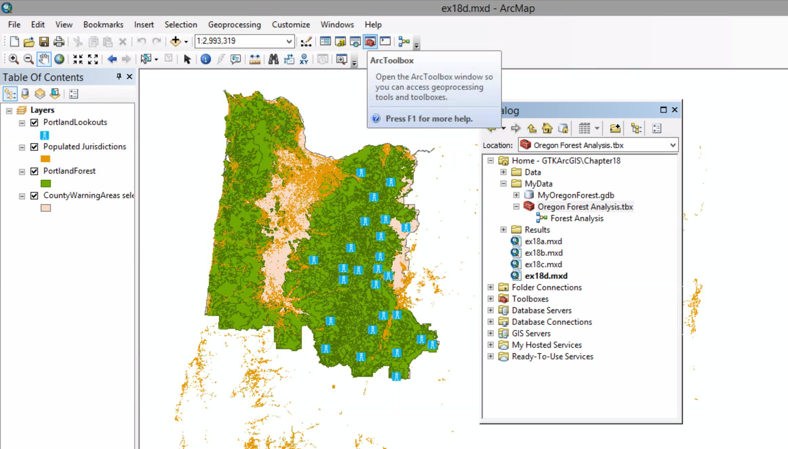

##### 10. In the Catalog window, click the Oregon Forest Analysis toolbox and drag it to the bottom of the ArcToolbox window.

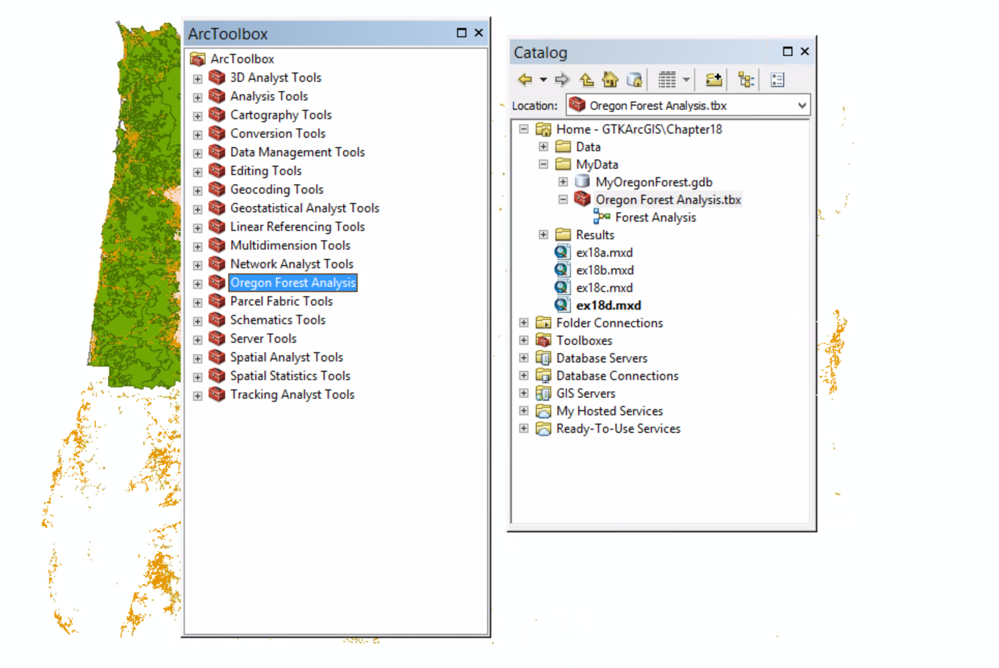

The Oregon Forest Analysis toolbox is automatically added and alphabetized with the other toolboxes.

##### 11. Close or hide the Catalog window, since it will no longer be needed.

##### 12. 